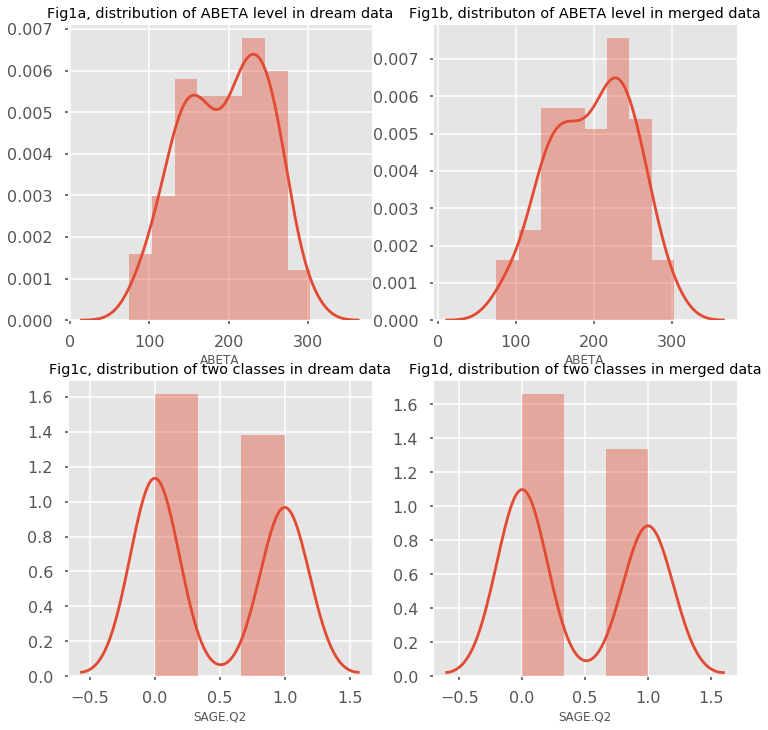
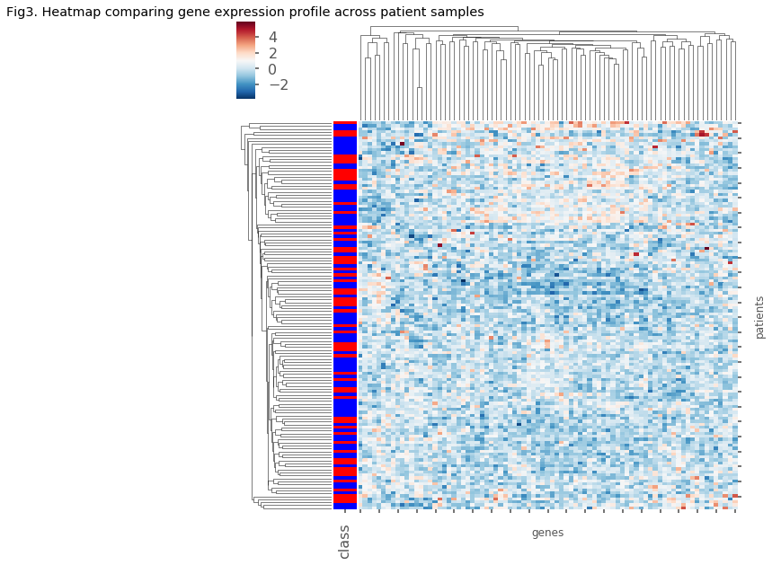
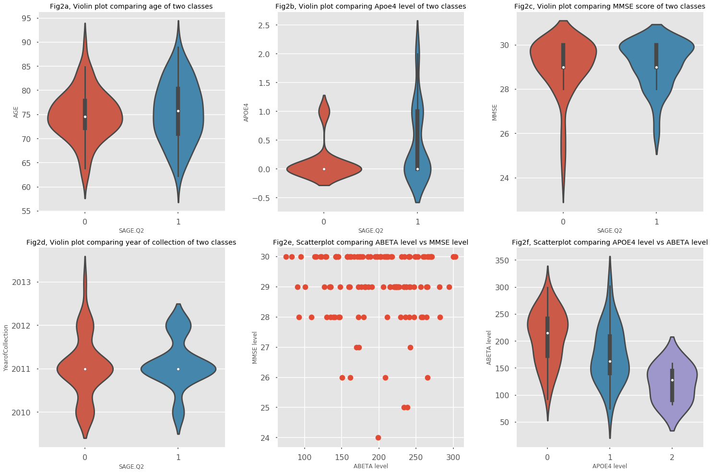

## Contents
{:.no_toc}
*  
{: toc}


```python
import warnings
warnings.filterwarnings('ignore')

import numpy as np
import pandas as pd
import matplotlib
import matplotlib.pyplot as plt
import sklearn.metrics as metrics
from scipy import stats
from sklearn.model_selection import cross_val_score
from sklearn.model_selection import GridSearchCV
from sklearn.model_selection import train_test_split

from sklearn.decomposition import PCA
from sklearn.linear_model import LinearRegression
from sklearn.linear_model import Ridge
from sklearn.linear_model import RidgeCV
from sklearn.linear_model import LassoCV
from sklearn.linear_model import ElasticNetCV
from sklearn.linear_model import ElasticNet
from sklearn.utils import resample
from sklearn.model_selection import cross_val_score
from sklearn.metrics import accuracy_score
from sklearn.metrics import r2_score
from sklearn.ensemble import GradientBoostingRegressor
from scipy.stats import pearsonr
from sklearn.gaussian_process import GaussianProcessRegressor as GPR

import seaborn.apionly as sns
sns.set_context("poster")
from IPython.display import display
matplotlib.style.use('ggplot')
%matplotlib inline
```


```python
file_expression = pd.read_csv("../ADNI_download/ADNI_Gene_Expression_Profile/ADNI_Gene_Expression_Profile.csv",header=None, index_col=0) #, dtype={'INDEX':str})
file_expression.describe()
```


<div>
<style>
    .dataframe thead tr:only-child th {
        text-align: right;
    }

    .dataframe thead th {
        text-align: left;
    }

    .dataframe tbody tr th {
        vertical-align: top;
    }
</style>
<table border="1" class="dataframe">
  <thead>
    <tr style="text-align: right;">
      <th></th>
      <th>1</th>
      <th>2</th>
      <th>3</th>
      <th>4</th>
      <th>5</th>
      <th>6</th>
      <th>7</th>
      <th>8</th>
      <th>9</th>
      <th>10</th>
      <th>...</th>
      <th>738</th>
      <th>739</th>
      <th>740</th>
      <th>741</th>
      <th>742</th>
      <th>743</th>
      <th>744</th>
      <th>745</th>
      <th>746</th>
      <th>747</th>
    </tr>
  </thead>
  <tbody>
    <tr>
      <th>count</th>
      <td>43789</td>
      <td>48158</td>
      <td>49394.000</td>
      <td>49394.000</td>
      <td>49394.00</td>
      <td>49394.000</td>
      <td>49394.000</td>
      <td>49394.000</td>
      <td>49394.000</td>
      <td>49394.000</td>
      <td>...</td>
      <td>49394.000</td>
      <td>49394.00</td>
      <td>49394.000</td>
      <td>49394.00</td>
      <td>49394.000</td>
      <td>49394.00</td>
      <td>49394.00</td>
      <td>49394.000</td>
      <td>49394.000</td>
      <td>49386</td>
    </tr>
    <tr>
      <th>unique</th>
      <td>18725</td>
      <td>20093</td>
      <td>10122.000</td>
      <td>10181.000</td>
      <td>10157.00</td>
      <td>10123.000</td>
      <td>10128.000</td>
      <td>10099.000</td>
      <td>10154.000</td>
      <td>10161.000</td>
      <td>...</td>
      <td>10139.000</td>
      <td>10087.00</td>
      <td>10153.000</td>
      <td>10118.00</td>
      <td>10196.000</td>
      <td>10158.00</td>
      <td>10118.00</td>
      <td>10122.000</td>
      <td>10135.000</td>
      <td>23398</td>
    </tr>
    <tr>
      <th>top</th>
      <td>LOC4763</td>
      <td>NF1</td>
      <td>2.269</td>
      <td>2.129</td>
      <td>2.27</td>
      <td>2.288</td>
      <td>2.293</td>
      <td>2.377</td>
      <td>2.191</td>
      <td>2.481</td>
      <td>...</td>
      <td>2.096</td>
      <td>2.46</td>
      <td>2.189</td>
      <td>2.23</td>
      <td>2.457</td>
      <td>2.38</td>
      <td>2.13</td>
      <td>2.491</td>
      <td>2.368</td>
      <td>{NO TARGETS}</td>
    </tr>
    <tr>
      <th>freq</th>
      <td>16</td>
      <td>19</td>
      <td>111.000</td>
      <td>123.000</td>
      <td>84.00</td>
      <td>93.000</td>
      <td>88.000</td>
      <td>120.000</td>
      <td>142.000</td>
      <td>97.000</td>
      <td>...</td>
      <td>113.000</td>
      <td>103.00</td>
      <td>122.000</td>
      <td>108.00</td>
      <td>59.000</td>
      <td>109.00</td>
      <td>120.00</td>
      <td>119.000</td>
      <td>109.000</td>
      <td>23</td>
    </tr>
  </tbody>
</table>
<p>4 rows × 747 columns</p>
</div>


```python
file_expression.head(20)
```


<div>
<style>
    .dataframe thead tr:only-child th {
        text-align: right;
    }

    .dataframe thead th {
        text-align: left;
    }

    .dataframe tbody tr th {
        vertical-align: top;
    }
</style>
<table border="1" class="dataframe">
  <thead>
    <tr style="text-align: right;">
      <th></th>
      <th>1</th>
      <th>2</th>
      <th>3</th>
      <th>4</th>
      <th>5</th>
      <th>6</th>
      <th>7</th>
      <th>8</th>
      <th>9</th>
      <th>10</th>
      <th>...</th>
      <th>738</th>
      <th>739</th>
      <th>740</th>
      <th>741</th>
      <th>742</th>
      <th>743</th>
      <th>744</th>
      <th>745</th>
      <th>746</th>
      <th>747</th>
    </tr>
    <tr>
      <th>0</th>
      <th></th>
      <th></th>
      <th></th>
      <th></th>
      <th></th>
      <th></th>
      <th></th>
      <th></th>
      <th></th>
      <th></th>
      <th></th>
      <th></th>
      <th></th>
      <th></th>
      <th></th>
      <th></th>
      <th></th>
      <th></th>
      <th></th>
      <th></th>
      <th></th>
    </tr>
  </thead>
  <tbody>
    <tr>
      <th>Phase</th>
      <td>NaN</td>
      <td>NaN</td>
      <td>ADNIGO</td>
      <td>ADNI2</td>
      <td>ADNI2</td>
      <td>ADNIGO</td>
      <td>ADNI2</td>
      <td>ADNI2</td>
      <td>ADNI2</td>
      <td>ADNIGO</td>
      <td>...</td>
      <td>ADNIGO</td>
      <td>ADNI2</td>
      <td>ADNIGO</td>
      <td>ADNI2</td>
      <td>ADNIGO</td>
      <td>ADNI2</td>
      <td>ADNI2</td>
      <td>ADNI2</td>
      <td>ADNI2</td>
      <td>NaN</td>
    </tr>
    <tr>
      <th>Visit</th>
      <td>NaN</td>
      <td>NaN</td>
      <td>m48</td>
      <td>v03</td>
      <td>v03</td>
      <td>m48</td>
      <td>v03</td>
      <td>v03</td>
      <td>v06</td>
      <td>bl</td>
      <td>...</td>
      <td>bl</td>
      <td>v03</td>
      <td>m60</td>
      <td>v03</td>
      <td>bl</td>
      <td>v03</td>
      <td>v03</td>
      <td>v03</td>
      <td>v06</td>
      <td>NaN</td>
    </tr>
    <tr>
      <th>SubjectID</th>
      <td>NaN</td>
      <td>NaN</td>
      <td>116_S_1249</td>
      <td>037_S_4410</td>
      <td>006_S_4153</td>
      <td>116_S_1232</td>
      <td>099_S_4205</td>
      <td>007_S_4467</td>
      <td>128_S_0205</td>
      <td>003_S_2374</td>
      <td>...</td>
      <td>022_S_2379</td>
      <td>014_S_4668</td>
      <td>130_S_0289</td>
      <td>141_S_4456</td>
      <td>009_S_2381</td>
      <td>053_S_4557</td>
      <td>073_S_4300</td>
      <td>041_S_4014</td>
      <td>007_S_0101</td>
      <td>NaN</td>
    </tr>
    <tr>
      <th>260/280</th>
      <td>NaN</td>
      <td>NaN</td>
      <td>2.05</td>
      <td>2.07</td>
      <td>2.04</td>
      <td>2.03</td>
      <td>2.01</td>
      <td>2.05</td>
      <td>1.95</td>
      <td>1.99</td>
      <td>...</td>
      <td>2.05</td>
      <td>2.05</td>
      <td>1.98</td>
      <td>2.09</td>
      <td>1.87</td>
      <td>2.03</td>
      <td>2.11</td>
      <td>1.94</td>
      <td>2.06</td>
      <td>NaN</td>
    </tr>
    <tr>
      <th>260/230</th>
      <td>NaN</td>
      <td>NaN</td>
      <td>0.55</td>
      <td>1.54</td>
      <td>2.1</td>
      <td>1.52</td>
      <td>1.6</td>
      <td>1.91</td>
      <td>1.47</td>
      <td>2.07</td>
      <td>...</td>
      <td>1.9</td>
      <td>2.05</td>
      <td>1.65</td>
      <td>1.56</td>
      <td>1.45</td>
      <td>1.33</td>
      <td>0.27</td>
      <td>1.72</td>
      <td>1.35</td>
      <td>NaN</td>
    </tr>
    <tr>
      <th>RIN</th>
      <td>NaN</td>
      <td>NaN</td>
      <td>7.7</td>
      <td>7.6</td>
      <td>7.2</td>
      <td>6.8</td>
      <td>7.9</td>
      <td>7</td>
      <td>7.9</td>
      <td>7.2</td>
      <td>...</td>
      <td>6.7</td>
      <td>6.5</td>
      <td>6.3</td>
      <td>6.4</td>
      <td>6.6</td>
      <td>6.8</td>
      <td>6.2</td>
      <td>5.8</td>
      <td>6.7</td>
      <td>NaN</td>
    </tr>
    <tr>
      <th>Affy Plate</th>
      <td>NaN</td>
      <td>NaN</td>
      <td>7</td>
      <td>3</td>
      <td>6</td>
      <td>7</td>
      <td>9</td>
      <td>4</td>
      <td>3</td>
      <td>8</td>
      <td>...</td>
      <td>8</td>
      <td>6</td>
      <td>9</td>
      <td>3</td>
      <td>8</td>
      <td>5</td>
      <td>3</td>
      <td>1</td>
      <td>4</td>
      <td>NaN</td>
    </tr>
    <tr>
      <th>YearofCollection</th>
      <td>NaN</td>
      <td>NaN</td>
      <td>2011</td>
      <td>2012</td>
      <td>2011</td>
      <td>2011</td>
      <td>2011</td>
      <td>2012</td>
      <td>2011</td>
      <td>2011</td>
      <td>...</td>
      <td>2011</td>
      <td>2012</td>
      <td>2011</td>
      <td>2012</td>
      <td>2011</td>
      <td>2012</td>
      <td>2011</td>
      <td>2011</td>
      <td>2012</td>
      <td>NaN</td>
    </tr>
    <tr>
      <th>ProbeSet</th>
      <td>LocusLink</td>
      <td>Symbol</td>
      <td>NaN</td>
      <td>NaN</td>
      <td>NaN</td>
      <td>NaN</td>
      <td>NaN</td>
      <td>NaN</td>
      <td>NaN</td>
      <td>NaN</td>
      <td>...</td>
      <td>NaN</td>
      <td>NaN</td>
      <td>NaN</td>
      <td>NaN</td>
      <td>NaN</td>
      <td>NaN</td>
      <td>NaN</td>
      <td>NaN</td>
      <td>NaN</td>
      <td>NaN</td>
    </tr>
    <tr>
      <th>11715100_at</th>
      <td>LOC8355</td>
      <td>HIST1H3G</td>
      <td>2.237</td>
      <td>2.294</td>
      <td>2.14</td>
      <td>2.062</td>
      <td>2.04</td>
      <td>2.439</td>
      <td>1.955</td>
      <td>2.372</td>
      <td>...</td>
      <td>2.34</td>
      <td>2.405</td>
      <td>2.349</td>
      <td>2.212</td>
      <td>2.382</td>
      <td>2.497</td>
      <td>2.309</td>
      <td>2.302</td>
      <td>2.661</td>
      <td>[HIST1H3G] histone cluster 1  H3g</td>
    </tr>
    <tr>
      <th>11715101_s_at</th>
      <td>LOC8355</td>
      <td>HIST1H3G</td>
      <td>2.624</td>
      <td>2.416</td>
      <td>2.322</td>
      <td>2.5</td>
      <td>2.395</td>
      <td>2.309</td>
      <td>2.451</td>
      <td>2.403</td>
      <td>...</td>
      <td>2.53</td>
      <td>2.513</td>
      <td>2.754</td>
      <td>2.559</td>
      <td>2.277</td>
      <td>2.466</td>
      <td>2.607</td>
      <td>2.569</td>
      <td>2.679</td>
      <td>[HIST1H3G] histone cluster 1  H3g</td>
    </tr>
    <tr>
      <th>11715102_x_at</th>
      <td>LOC8355</td>
      <td>HIST1H3G</td>
      <td>1.873</td>
      <td>1.884</td>
      <td>1.999</td>
      <td>1.851</td>
      <td>2.08</td>
      <td>1.997</td>
      <td>1.539</td>
      <td>1.926</td>
      <td>...</td>
      <td>2.057</td>
      <td>2.4</td>
      <td>2.247</td>
      <td>1.939</td>
      <td>2.107</td>
      <td>2.137</td>
      <td>2.075</td>
      <td>2.147</td>
      <td>2.028</td>
      <td>[HIST1H3G] histone cluster 1  H3g</td>
    </tr>
    <tr>
      <th>11715103_x_at</th>
      <td>LOC126282</td>
      <td>TNFAIP8L1</td>
      <td>2.92</td>
      <td>2.668</td>
      <td>3.634</td>
      <td>3.632</td>
      <td>3.278</td>
      <td>3.578</td>
      <td>3.362</td>
      <td>3.371</td>
      <td>...</td>
      <td>3.509</td>
      <td>4.134</td>
      <td>3.515</td>
      <td>3.707</td>
      <td>3.819</td>
      <td>3.541</td>
      <td>3.496</td>
      <td>4.037</td>
      <td>3.285</td>
      <td>[TNFAIP8L1] Tumor necrosis factor  alpha-induc...</td>
    </tr>
    <tr>
      <th>11715104_s_at</th>
      <td>LOC92736</td>
      <td>OTOP2</td>
      <td>2.147</td>
      <td>2.156</td>
      <td>2.516</td>
      <td>2.283</td>
      <td>2.251</td>
      <td>2.235</td>
      <td>1.992</td>
      <td>2.407</td>
      <td>...</td>
      <td>2.18</td>
      <td>2.576</td>
      <td>2.146</td>
      <td>2.228</td>
      <td>2.588</td>
      <td>2.256</td>
      <td>2.098</td>
      <td>2.376</td>
      <td>2.333</td>
      <td>[OTOP2] Otopetrin 2</td>
    </tr>
    <tr>
      <th>11715105_at</th>
      <td>LOC284099</td>
      <td>C17ORF78</td>
      <td>2.268</td>
      <td>2.13</td>
      <td>1.957</td>
      <td>2.347</td>
      <td>2.154</td>
      <td>2.055</td>
      <td>2.323</td>
      <td>2.084</td>
      <td>...</td>
      <td>2.067</td>
      <td>2.217</td>
      <td>2.258</td>
      <td>2.261</td>
      <td>2.201</td>
      <td>2.205</td>
      <td>2.161</td>
      <td>2.13</td>
      <td>2.074</td>
      <td>[C17orf78] Chromosome 17 open reading frame 78</td>
    </tr>
    <tr>
      <th>11715106_x_at</th>
      <td>NaN</td>
      <td>CTAGE6 || CTAGE15</td>
      <td>2.432</td>
      <td>2.27</td>
      <td>2.333</td>
      <td>2.258</td>
      <td>2.334</td>
      <td>2.45</td>
      <td>2.166</td>
      <td>2.397</td>
      <td>...</td>
      <td>2.451</td>
      <td>2.742</td>
      <td>2.361</td>
      <td>2.191</td>
      <td>2.531</td>
      <td>2.737</td>
      <td>2.439</td>
      <td>2.585</td>
      <td>2.854</td>
      <td>[CTAGE6 || CTAGE15] {Matches 2 Loci} CTAGE fam...</td>
    </tr>
    <tr>
      <th>11715107_s_at</th>
      <td>NaN</td>
      <td>F8A2 || F8A3 || F8A1</td>
      <td>4.6</td>
      <td>4.547</td>
      <td>4.442</td>
      <td>4.608</td>
      <td>4.536</td>
      <td>4.805</td>
      <td>4.587</td>
      <td>4.555</td>
      <td>...</td>
      <td>5.008</td>
      <td>5.077</td>
      <td>4.94</td>
      <td>4.593</td>
      <td>4.455</td>
      <td>4.725</td>
      <td>4.981</td>
      <td>5.005</td>
      <td>5.009</td>
      <td>[F8A2 || F8A3 || F8A1] {Matches 3 Loci} coagul...</td>
    </tr>
    <tr>
      <th>11715108_x_at</th>
      <td>LOC285501</td>
      <td>LINC01098</td>
      <td>2.771</td>
      <td>2.363</td>
      <td>2.544</td>
      <td>2.233</td>
      <td>2.546</td>
      <td>2.576</td>
      <td>2.517</td>
      <td>2.422</td>
      <td>...</td>
      <td>2.314</td>
      <td>2.905</td>
      <td>2.426</td>
      <td>2.635</td>
      <td>2.335</td>
      <td>2.078</td>
      <td>2.394</td>
      <td>2.396</td>
      <td>2.445</td>
      <td>[LINC01098] long intergenic non-protein coding...</td>
    </tr>
    <tr>
      <th>11715109_at</th>
      <td>LOC344658</td>
      <td>SAMD7</td>
      <td>2.931</td>
      <td>2.548</td>
      <td>2.814</td>
      <td>3.156</td>
      <td>2.864</td>
      <td>3.043</td>
      <td>2.731</td>
      <td>2.863</td>
      <td>...</td>
      <td>2.565</td>
      <td>2.96</td>
      <td>2.551</td>
      <td>2.785</td>
      <td>2.949</td>
      <td>2.863</td>
      <td>2.775</td>
      <td>2.491</td>
      <td>2.837</td>
      <td>[SAMD7] sterile alpha motif domain containing 7</td>
    </tr>
    <tr>
      <th>11715110_at</th>
      <td>LOC645432</td>
      <td>ARRDC5</td>
      <td>5.36</td>
      <td>5.031</td>
      <td>5.349</td>
      <td>5.865</td>
      <td>5.111</td>
      <td>5.027</td>
      <td>6.195</td>
      <td>4.91</td>
      <td>...</td>
      <td>5.404</td>
      <td>6.034</td>
      <td>4.55</td>
      <td>5.924</td>
      <td>5.609</td>
      <td>4.879</td>
      <td>5.279</td>
      <td>5.961</td>
      <td>5.437</td>
      <td>[ARRDC5] arrestin domain containing 5</td>
    </tr>
  </tbody>
</table>
<p>20 rows × 747 columns</p>
</div>


```python
## Set column names
col_names = file_expression.loc['SubjectID']
col_names[0:2]=['LocusLink','Symbol']
col_names
```


    1       LocusLink
    2          Symbol
    3      116_S_1249
    4      037_S_4410
    5      006_S_4153
    6      116_S_1232
    7      099_S_4205
    8      007_S_4467
    9      128_S_0205
    10     003_S_2374
    11     036_S_4491
    12     098_S_4059
    13     031_S_2018
    14     002_S_4654
    15     019_S_4285
    16     141_S_4426
    17     067_S_4072
    18     037_S_4308
    19     041_S_4200
    20     128_S_0200
    21     129_S_4220
    22     018_S_4313
    23     067_S_0257
    24     029_S_1218
    25     141_S_4053
    26     136_S_4408
    27     021_S_2142
    28     114_S_4404
    29     116_S_4167
    30     116_S_4209
              ...    
    718    131_S_0384
    719    135_S_4309
    720    129_S_4369
    721    137_S_0686
    722    128_S_4571
    723    099_S_2063
    724    011_S_4120
    725    041_S_0125
    726    053_S_2357
    727    137_S_0973
    728    021_S_0984
    729    027_S_0116
    730    052_S_0951
    731    014_S_4401
    732    036_S_4562
    733    137_S_0459
    734    018_S_4696
    735    023_S_4164
    736    128_S_2130
    737    082_S_4339
    738    022_S_2379
    739    014_S_4668
    740    130_S_0289
    741    141_S_4456
    742    009_S_2381
    743    053_S_4557
    744    073_S_4300
    745    041_S_4014
    746    007_S_0101
    747           NaN
    Name: SubjectID, Length: 747, dtype: object


```python
file_expression.columns = list(col_names)
file_expression.head()
```


<div>
<style>
    .dataframe thead tr:only-child th {
        text-align: right;
    }

    .dataframe thead th {
        text-align: left;
    }

    .dataframe tbody tr th {
        vertical-align: top;
    }
</style>
<table border="1" class="dataframe">
  <thead>
    <tr style="text-align: right;">
      <th></th>
      <th>LocusLink</th>
      <th>Symbol</th>
      <th>116_S_1249</th>
      <th>037_S_4410</th>
      <th>006_S_4153</th>
      <th>116_S_1232</th>
      <th>099_S_4205</th>
      <th>007_S_4467</th>
      <th>128_S_0205</th>
      <th>003_S_2374</th>
      <th>...</th>
      <th>022_S_2379</th>
      <th>014_S_4668</th>
      <th>130_S_0289</th>
      <th>141_S_4456</th>
      <th>009_S_2381</th>
      <th>053_S_4557</th>
      <th>073_S_4300</th>
      <th>041_S_4014</th>
      <th>007_S_0101</th>
      <th>nan</th>
    </tr>
    <tr>
      <th>0</th>
      <th></th>
      <th></th>
      <th></th>
      <th></th>
      <th></th>
      <th></th>
      <th></th>
      <th></th>
      <th></th>
      <th></th>
      <th></th>
      <th></th>
      <th></th>
      <th></th>
      <th></th>
      <th></th>
      <th></th>
      <th></th>
      <th></th>
      <th></th>
      <th></th>
    </tr>
  </thead>
  <tbody>
    <tr>
      <th>Phase</th>
      <td>NaN</td>
      <td>NaN</td>
      <td>ADNIGO</td>
      <td>ADNI2</td>
      <td>ADNI2</td>
      <td>ADNIGO</td>
      <td>ADNI2</td>
      <td>ADNI2</td>
      <td>ADNI2</td>
      <td>ADNIGO</td>
      <td>...</td>
      <td>ADNIGO</td>
      <td>ADNI2</td>
      <td>ADNIGO</td>
      <td>ADNI2</td>
      <td>ADNIGO</td>
      <td>ADNI2</td>
      <td>ADNI2</td>
      <td>ADNI2</td>
      <td>ADNI2</td>
      <td>NaN</td>
    </tr>
    <tr>
      <th>Visit</th>
      <td>NaN</td>
      <td>NaN</td>
      <td>m48</td>
      <td>v03</td>
      <td>v03</td>
      <td>m48</td>
      <td>v03</td>
      <td>v03</td>
      <td>v06</td>
      <td>bl</td>
      <td>...</td>
      <td>bl</td>
      <td>v03</td>
      <td>m60</td>
      <td>v03</td>
      <td>bl</td>
      <td>v03</td>
      <td>v03</td>
      <td>v03</td>
      <td>v06</td>
      <td>NaN</td>
    </tr>
    <tr>
      <th>SubjectID</th>
      <td>LocusLink</td>
      <td>Symbol</td>
      <td>116_S_1249</td>
      <td>037_S_4410</td>
      <td>006_S_4153</td>
      <td>116_S_1232</td>
      <td>099_S_4205</td>
      <td>007_S_4467</td>
      <td>128_S_0205</td>
      <td>003_S_2374</td>
      <td>...</td>
      <td>022_S_2379</td>
      <td>014_S_4668</td>
      <td>130_S_0289</td>
      <td>141_S_4456</td>
      <td>009_S_2381</td>
      <td>053_S_4557</td>
      <td>073_S_4300</td>
      <td>041_S_4014</td>
      <td>007_S_0101</td>
      <td>NaN</td>
    </tr>
    <tr>
      <th>260/280</th>
      <td>NaN</td>
      <td>NaN</td>
      <td>2.05</td>
      <td>2.07</td>
      <td>2.04</td>
      <td>2.03</td>
      <td>2.01</td>
      <td>2.05</td>
      <td>1.95</td>
      <td>1.99</td>
      <td>...</td>
      <td>2.05</td>
      <td>2.05</td>
      <td>1.98</td>
      <td>2.09</td>
      <td>1.87</td>
      <td>2.03</td>
      <td>2.11</td>
      <td>1.94</td>
      <td>2.06</td>
      <td>NaN</td>
    </tr>
    <tr>
      <th>260/230</th>
      <td>NaN</td>
      <td>NaN</td>
      <td>0.55</td>
      <td>1.54</td>
      <td>2.1</td>
      <td>1.52</td>
      <td>1.6</td>
      <td>1.91</td>
      <td>1.47</td>
      <td>2.07</td>
      <td>...</td>
      <td>1.9</td>
      <td>2.05</td>
      <td>1.65</td>
      <td>1.56</td>
      <td>1.45</td>
      <td>1.33</td>
      <td>0.27</td>
      <td>1.72</td>
      <td>1.35</td>
      <td>NaN</td>
    </tr>
  </tbody>
</table>
<p>5 rows × 747 columns</p>
</div>


```python
transformed_table = file_expression
transformed_table = transformed_table.drop(['LocusLink','Symbol'],axis=1)
transformed_table = transformed_table.drop(transformed_table.columns[-1:],axis=1)
#transformed_table = transformed_table.drop(['SubjectID'])
transformed_table = transformed_table.T
transformed_table = transformed_table.rename(columns = {'SubjectID':'PTID'})
transformed_table.head()
```


<div>
<style>
    .dataframe thead tr:only-child th {
        text-align: right;
    }

    .dataframe thead th {
        text-align: left;
    }

    .dataframe tbody tr th {
        vertical-align: top;
    }
</style>
<table border="1" class="dataframe">
  <thead>
    <tr style="text-align: right;">
      <th></th>
      <th>Phase</th>
      <th>Visit</th>
      <th>PTID</th>
      <th>260/280</th>
      <th>260/230</th>
      <th>RIN</th>
      <th>Affy Plate</th>
      <th>YearofCollection</th>
      <th>ProbeSet</th>
      <th>11715100_at</th>
      <th>...</th>
      <th>AFFX-r2-TagH_at</th>
      <th>AFFX-r2-TagIN-3_at</th>
      <th>AFFX-r2-TagIN-5_at</th>
      <th>AFFX-r2-TagIN-M_at</th>
      <th>AFFX-r2-TagJ-3_at</th>
      <th>AFFX-r2-TagJ-5_at</th>
      <th>AFFX-r2-TagO-3_at</th>
      <th>AFFX-r2-TagO-5_at</th>
      <th>AFFX-r2-TagQ-3_at</th>
      <th>AFFX-r2-TagQ-5_at</th>
    </tr>
  </thead>
  <tbody>
    <tr>
      <th>116_S_1249</th>
      <td>ADNIGO</td>
      <td>m48</td>
      <td>116_S_1249</td>
      <td>2.05</td>
      <td>0.55</td>
      <td>7.7</td>
      <td>7</td>
      <td>2011</td>
      <td>NaN</td>
      <td>2.237</td>
      <td>...</td>
      <td>2.355</td>
      <td>2.624</td>
      <td>2.01</td>
      <td>2.906</td>
      <td>2.463</td>
      <td>2.05</td>
      <td>2.06</td>
      <td>1.858</td>
      <td>2.028</td>
      <td>2.162</td>
    </tr>
    <tr>
      <th>037_S_4410</th>
      <td>ADNI2</td>
      <td>v03</td>
      <td>037_S_4410</td>
      <td>2.07</td>
      <td>1.54</td>
      <td>7.6</td>
      <td>3</td>
      <td>2012</td>
      <td>NaN</td>
      <td>2.294</td>
      <td>...</td>
      <td>2.1</td>
      <td>2.82</td>
      <td>1.726</td>
      <td>2.465</td>
      <td>2.26</td>
      <td>1.933</td>
      <td>1.717</td>
      <td>2.208</td>
      <td>2.058</td>
      <td>1.882</td>
    </tr>
    <tr>
      <th>006_S_4153</th>
      <td>ADNI2</td>
      <td>v03</td>
      <td>006_S_4153</td>
      <td>2.04</td>
      <td>2.1</td>
      <td>7.2</td>
      <td>6</td>
      <td>2011</td>
      <td>NaN</td>
      <td>2.14</td>
      <td>...</td>
      <td>2.165</td>
      <td>2.455</td>
      <td>1.84</td>
      <td>2.681</td>
      <td>2.251</td>
      <td>1.985</td>
      <td>1.77</td>
      <td>2.184</td>
      <td>2.007</td>
      <td>2.134</td>
    </tr>
    <tr>
      <th>116_S_1232</th>
      <td>ADNIGO</td>
      <td>m48</td>
      <td>116_S_1232</td>
      <td>2.03</td>
      <td>1.52</td>
      <td>6.8</td>
      <td>7</td>
      <td>2011</td>
      <td>NaN</td>
      <td>2.062</td>
      <td>...</td>
      <td>2.094</td>
      <td>2.599</td>
      <td>1.837</td>
      <td>2.713</td>
      <td>2.158</td>
      <td>1.916</td>
      <td>1.878</td>
      <td>2.163</td>
      <td>2.185</td>
      <td>2.099</td>
    </tr>
    <tr>
      <th>099_S_4205</th>
      <td>ADNI2</td>
      <td>v03</td>
      <td>099_S_4205</td>
      <td>2.01</td>
      <td>1.6</td>
      <td>7.9</td>
      <td>9</td>
      <td>2011</td>
      <td>NaN</td>
      <td>2.04</td>
      <td>...</td>
      <td>1.973</td>
      <td>2.544</td>
      <td>1.909</td>
      <td>2.548</td>
      <td>2.266</td>
      <td>2.077</td>
      <td>1.838</td>
      <td>2.085</td>
      <td>1.941</td>
      <td>1.883</td>
    </tr>
  </tbody>
</table>
<p>5 rows × 49395 columns</p>
</div>


```python
transformed_table.describe()
```


<div>
<style>
    .dataframe thead tr:only-child th {
        text-align: right;
    }

    .dataframe thead th {
        text-align: left;
    }

    .dataframe tbody tr th {
        vertical-align: top;
    }
</style>
<table border="1" class="dataframe">
  <thead>
    <tr style="text-align: right;">
      <th></th>
      <th>Phase</th>
      <th>Visit</th>
      <th>PTID</th>
      <th>260/280</th>
      <th>260/230</th>
      <th>RIN</th>
      <th>Affy Plate</th>
      <th>YearofCollection</th>
      <th>ProbeSet</th>
      <th>11715100_at</th>
      <th>...</th>
      <th>AFFX-r2-TagH_at</th>
      <th>AFFX-r2-TagIN-3_at</th>
      <th>AFFX-r2-TagIN-5_at</th>
      <th>AFFX-r2-TagIN-M_at</th>
      <th>AFFX-r2-TagJ-3_at</th>
      <th>AFFX-r2-TagJ-5_at</th>
      <th>AFFX-r2-TagO-3_at</th>
      <th>AFFX-r2-TagO-5_at</th>
      <th>AFFX-r2-TagQ-3_at</th>
      <th>AFFX-r2-TagQ-5_at</th>
    </tr>
  </thead>
  <tbody>
    <tr>
      <th>count</th>
      <td>744</td>
      <td>744</td>
      <td>744</td>
      <td>744</td>
      <td>744</td>
      <td>744</td>
      <td>744</td>
      <td>744</td>
      <td>0.0</td>
      <td>744</td>
      <td>...</td>
      <td>744.000</td>
      <td>744.00</td>
      <td>744.000</td>
      <td>744.000</td>
      <td>744.000</td>
      <td>744.000</td>
      <td>744.000</td>
      <td>744.000</td>
      <td>744.000</td>
      <td>744.000</td>
    </tr>
    <tr>
      <th>unique</th>
      <td>2</td>
      <td>12</td>
      <td>744</td>
      <td>40</td>
      <td>173</td>
      <td>38</td>
      <td>9</td>
      <td>4</td>
      <td>0.0</td>
      <td>450</td>
      <td>...</td>
      <td>389.000</td>
      <td>440.00</td>
      <td>374.000</td>
      <td>434.000</td>
      <td>395.000</td>
      <td>360.000</td>
      <td>352.000</td>
      <td>431.000</td>
      <td>382.000</td>
      <td>399.000</td>
    </tr>
    <tr>
      <th>top</th>
      <td>ADNI2</td>
      <td>v03</td>
      <td>018_S_2138</td>
      <td>2.03</td>
      <td>1.65</td>
      <td>7.1</td>
      <td>3</td>
      <td>2011</td>
      <td>NaN</td>
      <td>2.435</td>
      <td>...</td>
      <td>2.181</td>
      <td>2.71</td>
      <td>1.828</td>
      <td>2.613</td>
      <td>2.337</td>
      <td>1.983</td>
      <td>1.849</td>
      <td>2.262</td>
      <td>1.925</td>
      <td>2.125</td>
    </tr>
    <tr>
      <th>freq</th>
      <td>449</td>
      <td>357</td>
      <td>1</td>
      <td>73</td>
      <td>13</td>
      <td>61</td>
      <td>88</td>
      <td>383</td>
      <td>NaN</td>
      <td>5</td>
      <td>...</td>
      <td>7.000</td>
      <td>7.00</td>
      <td>7.000</td>
      <td>6.000</td>
      <td>12.000</td>
      <td>9.000</td>
      <td>9.000</td>
      <td>6.000</td>
      <td>7.000</td>
      <td>7.000</td>
    </tr>
  </tbody>
</table>
<p>4 rows × 49395 columns</p>
</div>


```python
## Combine gene expression data with dream data
dream_data = pd.read_csv('../ADNI_download/AD_Challenge_Training_Data_Clinical_Updated_7.22.2014/ADNI_Training_Q2_APOE_July22.2014.csv')
dream_data.head()
```


<div>
<style>
    .dataframe thead tr:only-child th {
        text-align: right;
    }

    .dataframe thead th {
        text-align: left;
    }

    .dataframe tbody tr th {
        vertical-align: top;
    }
</style>
<table border="1" class="dataframe">
  <thead>
    <tr style="text-align: right;">
      <th></th>
      <th>RID</th>
      <th>PTID</th>
      <th>AGE</th>
      <th>PTGENDER</th>
      <th>PTEDUCAT</th>
      <th>APOE4</th>
      <th>MMSE</th>
      <th>ABETA</th>
      <th>SAGE.Q2</th>
      <th>APOE Genotype</th>
    </tr>
  </thead>
  <tbody>
    <tr>
      <th>0</th>
      <td>5</td>
      <td>011_S_0005</td>
      <td>73.7</td>
      <td>Male</td>
      <td>16</td>
      <td>0</td>
      <td>29</td>
      <td>115.0</td>
      <td>1</td>
      <td>3,3</td>
    </tr>
    <tr>
      <th>1</th>
      <td>19</td>
      <td>067_S_0019</td>
      <td>73.1</td>
      <td>Female</td>
      <td>18</td>
      <td>0</td>
      <td>29</td>
      <td>260.0</td>
      <td>0</td>
      <td>2,3</td>
    </tr>
    <tr>
      <th>2</th>
      <td>31</td>
      <td>023_S_0031</td>
      <td>77.7</td>
      <td>Female</td>
      <td>18</td>
      <td>0</td>
      <td>30</td>
      <td>240.0</td>
      <td>0</td>
      <td>3,3</td>
    </tr>
    <tr>
      <th>3</th>
      <td>43</td>
      <td>018_S_0043</td>
      <td>76.2</td>
      <td>Male</td>
      <td>16</td>
      <td>0</td>
      <td>29</td>
      <td>175.0</td>
      <td>1</td>
      <td>2,3</td>
    </tr>
    <tr>
      <th>4</th>
      <td>47</td>
      <td>100_S_0047</td>
      <td>84.7</td>
      <td>Male</td>
      <td>20</td>
      <td>0</td>
      <td>30</td>
      <td>252.0</td>
      <td>0</td>
      <td>2,3</td>
    </tr>
  </tbody>
</table>
</div>


```python
dream_data.describe()
```


<div>
<style>
    .dataframe thead tr:only-child th {
        text-align: right;
    }

    .dataframe thead th {
        text-align: left;
    }

    .dataframe tbody tr th {
        vertical-align: top;
    }
</style>
<table border="1" class="dataframe">
  <thead>
    <tr style="text-align: right;">
      <th></th>
      <th>RID</th>
      <th>AGE</th>
      <th>PTEDUCAT</th>
      <th>APOE4</th>
      <th>MMSE</th>
      <th>ABETA</th>
      <th>SAGE.Q2</th>
    </tr>
  </thead>
  <tbody>
    <tr>
      <th>count</th>
      <td>176.000000</td>
      <td>176.000000</td>
      <td>176.000000</td>
      <td>176.000000</td>
      <td>176.000000</td>
      <td>176.000000</td>
      <td>176.000000</td>
    </tr>
    <tr>
      <th>mean</th>
      <td>2543.375000</td>
      <td>75.309091</td>
      <td>16.255682</td>
      <td>0.272727</td>
      <td>29.028409</td>
      <td>195.500000</td>
      <td>0.460227</td>
    </tr>
    <tr>
      <th>std</th>
      <td>1874.399901</td>
      <td>5.364692</td>
      <td>2.600543</td>
      <td>0.517737</td>
      <td>1.239488</td>
      <td>53.370559</td>
      <td>0.499838</td>
    </tr>
    <tr>
      <th>min</th>
      <td>5.000000</td>
      <td>62.000000</td>
      <td>8.000000</td>
      <td>0.000000</td>
      <td>24.000000</td>
      <td>75.000000</td>
      <td>0.000000</td>
    </tr>
    <tr>
      <th>25%</th>
      <td>558.000000</td>
      <td>71.775000</td>
      <td>14.000000</td>
      <td>0.000000</td>
      <td>29.000000</td>
      <td>149.950000</td>
      <td>0.000000</td>
    </tr>
    <tr>
      <th>50%</th>
      <td>4032.500000</td>
      <td>74.900000</td>
      <td>16.000000</td>
      <td>0.000000</td>
      <td>29.000000</td>
      <td>202.000000</td>
      <td>0.000000</td>
    </tr>
    <tr>
      <th>75%</th>
      <td>4281.250000</td>
      <td>78.400000</td>
      <td>18.000000</td>
      <td>0.000000</td>
      <td>30.000000</td>
      <td>240.000000</td>
      <td>1.000000</td>
    </tr>
    <tr>
      <th>max</th>
      <td>4516.000000</td>
      <td>89.600000</td>
      <td>20.000000</td>
      <td>2.000000</td>
      <td>30.000000</td>
      <td>302.800000</td>
      <td>1.000000</td>
    </tr>
  </tbody>
</table>
</div>


```python
data_common = pd.merge(left=dream_data, right=transformed_table, how='inner')
data_common = data_common.sort_values(by='ABETA')
data_common.head()
```


<div>
<style>
    .dataframe thead tr:only-child th {
        text-align: right;
    }

    .dataframe thead th {
        text-align: left;
    }

    .dataframe tbody tr th {
        vertical-align: top;
    }
</style>
<table border="1" class="dataframe">
  <thead>
    <tr style="text-align: right;">
      <th></th>
      <th>RID</th>
      <th>PTID</th>
      <th>AGE</th>
      <th>PTGENDER</th>
      <th>PTEDUCAT</th>
      <th>APOE4</th>
      <th>MMSE</th>
      <th>ABETA</th>
      <th>SAGE.Q2</th>
      <th>APOE Genotype</th>
      <th>...</th>
      <th>AFFX-r2-TagH_at</th>
      <th>AFFX-r2-TagIN-3_at</th>
      <th>AFFX-r2-TagIN-5_at</th>
      <th>AFFX-r2-TagIN-M_at</th>
      <th>AFFX-r2-TagJ-3_at</th>
      <th>AFFX-r2-TagJ-5_at</th>
      <th>AFFX-r2-TagO-3_at</th>
      <th>AFFX-r2-TagO-5_at</th>
      <th>AFFX-r2-TagQ-3_at</th>
      <th>AFFX-r2-TagQ-5_at</th>
    </tr>
  </thead>
  <tbody>
    <tr>
      <th>40</th>
      <td>984</td>
      <td>021_S_0984</td>
      <td>76.6</td>
      <td>Male</td>
      <td>14</td>
      <td>1</td>
      <td>30</td>
      <td>75.0</td>
      <td>1</td>
      <td>3,4</td>
      <td>...</td>
      <td>2.258</td>
      <td>3.229</td>
      <td>1.817</td>
      <td>2.565</td>
      <td>2.13</td>
      <td>1.829</td>
      <td>1.596</td>
      <td>2.394</td>
      <td>1.887</td>
      <td>2.09</td>
    </tr>
    <tr>
      <th>77</th>
      <td>4179</td>
      <td>033_S_4179</td>
      <td>83.0</td>
      <td>Male</td>
      <td>20</td>
      <td>2</td>
      <td>30</td>
      <td>82.7</td>
      <td>1</td>
      <td>4,4</td>
      <td>...</td>
      <td>2.196</td>
      <td>2.655</td>
      <td>1.883</td>
      <td>2.46</td>
      <td>2.24</td>
      <td>2.002</td>
      <td>2.052</td>
      <td>2.262</td>
      <td>1.982</td>
      <td>2.024</td>
    </tr>
    <tr>
      <th>95</th>
      <td>4339</td>
      <td>082_S_4339</td>
      <td>84.3</td>
      <td>Male</td>
      <td>17</td>
      <td>2</td>
      <td>29</td>
      <td>90.7</td>
      <td>1</td>
      <td>4,4</td>
      <td>...</td>
      <td>2.274</td>
      <td>2.747</td>
      <td>1.918</td>
      <td>2.67</td>
      <td>2.402</td>
      <td>1.792</td>
      <td>1.808</td>
      <td>2.588</td>
      <td>2.013</td>
      <td>2.304</td>
    </tr>
    <tr>
      <th>124</th>
      <td>4474</td>
      <td>031_S_4474</td>
      <td>85.6</td>
      <td>Male</td>
      <td>18</td>
      <td>0</td>
      <td>28</td>
      <td>92.5</td>
      <td>1</td>
      <td>3,3</td>
      <td>...</td>
      <td>2.178</td>
      <td>2.941</td>
      <td>1.878</td>
      <td>3.114</td>
      <td>2.421</td>
      <td>2.028</td>
      <td>1.76</td>
      <td>2.253</td>
      <td>1.94</td>
      <td>2.089</td>
    </tr>
    <tr>
      <th>94</th>
      <td>4335</td>
      <td>021_S_4335</td>
      <td>71.7</td>
      <td>Female</td>
      <td>15</td>
      <td>0</td>
      <td>30</td>
      <td>95.4</td>
      <td>1</td>
      <td>3,3</td>
      <td>...</td>
      <td>2.342</td>
      <td>2.579</td>
      <td>1.905</td>
      <td>2.725</td>
      <td>2.472</td>
      <td>1.804</td>
      <td>2.122</td>
      <td>2.035</td>
      <td>1.932</td>
      <td>1.942</td>
    </tr>
  </tbody>
</table>
<p>5 rows × 49404 columns</p>
</div>


```python
data_common.shape
```


    (130, 49404)


```python
data_common.columns[0:30]
```


    Index(['RID', 'PTID', 'AGE', 'PTGENDER', 'PTEDUCAT', 'APOE4', 'MMSE', 'ABETA',
           'SAGE.Q2', 'APOE Genotype', 'Phase', 'Visit', '260/280', '260/230',
           'RIN', 'Affy Plate', 'YearofCollection', 'ProbeSet', '11715100_at',
           '11715101_s_at', '11715102_x_at', '11715103_x_at', '11715104_s_at',
           '11715105_at', '11715106_x_at', '11715107_s_at', '11715108_x_at',
           '11715109_at', '11715110_at', '11715111_s_at'],
          dtype='object')


```python
fig, axes = plt.subplots(ncols=2, nrows=2, figsize=(12,12))
sns.distplot(dream_data['ABETA'], ax=axes[0,0])
axes[0,0].set_title("Fig1a, distribution of ABETA level in dream data")
sns.distplot(data_common['ABETA'], ax=axes[0,1])
axes[0,1].set_title("Fig1b, distributon of ABETA level in merged data")
sns.distplot(dream_data['SAGE.Q2'], ax=axes[1,0])
axes[1,0].set_title("Fig1c, distribution of two classes in dream data")
sns.distplot(data_common['SAGE.Q2'], ax=axes[1,1])
axes[1,1].set_title("Fig1d, distribution of two classes in merged data")
```


    <matplotlib.text.Text at 0x1a0f3c7e48>





```python
## Check gene expression profile difference by heatmap visualization
select_data = data_common[data_common.columns[19:100]]
select_data = select_data.convert_objects(convert_numeric=True)
select_data['class'] = data_common['SAGE.Q2']
exp_table = select_data.pop('class')
exp = dict(zip(exp_table.unique(), 'rbg'))
row_colors = exp_table.map(exp)
g = sns.clustermap(select_data, row_colors=row_colors, z_score=1, cmap="RdBu_r", mask=select_data.isnull());
plt.setp(g.ax_heatmap.set_yticklabels(''));
plt.setp(g.ax_heatmap.set_xticklabels(''));
plt.setp(g.ax_heatmap.set_xlabel('genes'));
plt.setp(g.ax_heatmap.set_ylabel('patients'));
plt.title("Fig3. Heatmap comparing gene expression profile across patient samples")
#sns.clustermap(select_data, row_colors=row_colors, z_score=0, annot=False, row_cluster=False, mask=select_data.isnull())
```


    
    
      agg_filter: unknown
      alpha: float (0.0 transparent through 1.0 opaque) 
      animated: [True | False] 
      axes: an :class:`~matplotlib.axes.Axes` instance 
      backgroundcolor: any matplotlib color 
      bbox: FancyBboxPatch prop dict 
      clip_box: a :class:`matplotlib.transforms.Bbox` instance 
      clip_on: [True | False] 
      clip_path: [ (:class:`~matplotlib.path.Path`, :class:`~matplotlib.transforms.Transform`) | :class:`~matplotlib.patches.Patch` | None ] 
      color: any matplotlib color 
      contains: a callable function 
      family or fontfamily or fontname or name: [FONTNAME | 'serif' | 'sans-serif' | 'cursive' | 'fantasy' | 'monospace' ] 
      figure: a :class:`matplotlib.figure.Figure` instance 
      fontproperties or font_properties: a :class:`matplotlib.font_manager.FontProperties` instance 
      gid: an id string 
      horizontalalignment or ha: [ 'center' | 'right' | 'left' ] 
      label: string or anything printable with '%s' conversion. 
      linespacing: float (multiple of font size) 
      multialignment: ['left' | 'right' | 'center' ] 
      path_effects: unknown
      picker: [None|float|boolean|callable] 
      position: (x,y) 
      rasterized: [True | False | None] 
      rotation: [ angle in degrees | 'vertical' | 'horizontal' ] 
      rotation_mode: unknown
      size or fontsize: [size in points | 'xx-small' | 'x-small' | 'small' | 'medium' | 'large' | 'x-large' | 'xx-large' ] 
      sketch_params: unknown
      snap: unknown
      stretch or fontstretch: [a numeric value in range 0-1000 | 'ultra-condensed' | 'extra-condensed' | 'condensed' | 'semi-condensed' | 'normal' | 'semi-expanded' | 'expanded' | 'extra-expanded' | 'ultra-expanded' ] 
      style or fontstyle: [ 'normal' | 'italic' | 'oblique'] 
      text: string or anything printable with '%s' conversion. 
      transform: :class:`~matplotlib.transforms.Transform` instance 
      url: a url string 
      usetex: unknown
      variant or fontvariant: [ 'normal' | 'small-caps' ] 
      verticalalignment or ma or va: [ 'center' | 'top' | 'bottom' | 'baseline' ] 
      visible: [True | False] 
      weight or fontweight: [a numeric value in range 0-1000 | 'ultralight' | 'light' | 'normal' | 'regular' | 'book' | 'medium' | 'roman' | 'semibold' | 'demibold' | 'demi' | 'bold' | 'heavy' | 'extra bold' | 'black' ] 
      wrap: unknown
      x: float 
      y: float 
      zorder: any number 
      agg_filter: unknown
      alpha: float (0.0 transparent through 1.0 opaque) 
      animated: [True | False] 
      axes: an :class:`~matplotlib.axes.Axes` instance 
      backgroundcolor: any matplotlib color 
      bbox: FancyBboxPatch prop dict 
      clip_box: a :class:`matplotlib.transforms.Bbox` instance 
      clip_on: [True | False] 
      clip_path: [ (:class:`~matplotlib.path.Path`, :class:`~matplotlib.transforms.Transform`) | :class:`~matplotlib.patches.Patch` | None ] 
      color: any matplotlib color 
      contains: a callable function 
      family or fontfamily or fontname or name: [FONTNAME | 'serif' | 'sans-serif' | 'cursive' | 'fantasy' | 'monospace' ] 
      figure: a :class:`matplotlib.figure.Figure` instance 
      fontproperties or font_properties: a :class:`matplotlib.font_manager.FontProperties` instance 
      gid: an id string 
      horizontalalignment or ha: [ 'center' | 'right' | 'left' ] 
      label: string or anything printable with '%s' conversion. 
      linespacing: float (multiple of font size) 
      multialignment: ['left' | 'right' | 'center' ] 
      path_effects: unknown
      picker: [None|float|boolean|callable] 
      position: (x,y) 
      rasterized: [True | False | None] 
      rotation: [ angle in degrees | 'vertical' | 'horizontal' ] 
      rotation_mode: unknown
      size or fontsize: [size in points | 'xx-small' | 'x-small' | 'small' | 'medium' | 'large' | 'x-large' | 'xx-large' ] 
      sketch_params: unknown
      snap: unknown
      stretch or fontstretch: [a numeric value in range 0-1000 | 'ultra-condensed' | 'extra-condensed' | 'condensed' | 'semi-condensed' | 'normal' | 'semi-expanded' | 'expanded' | 'extra-expanded' | 'ultra-expanded' ] 
      style or fontstyle: [ 'normal' | 'italic' | 'oblique'] 
      text: string or anything printable with '%s' conversion. 
      transform: :class:`~matplotlib.transforms.Transform` instance 
      url: a url string 
      usetex: unknown
      variant or fontvariant: [ 'normal' | 'small-caps' ] 
      verticalalignment or ma or va: [ 'center' | 'top' | 'bottom' | 'baseline' ] 
      visible: [True | False] 
      weight or fontweight: [a numeric value in range 0-1000 | 'ultralight' | 'light' | 'normal' | 'regular' | 'book' | 'medium' | 'roman' | 'semibold' | 'demibold' | 'demi' | 'bold' | 'heavy' | 'extra bold' | 'black' ] 
      wrap: unknown
      x: float 
      y: float 
      zorder: any number 


    <matplotlib.text.Text at 0x1a345becc0>





```python
data_common.columns[0:30]
```


    Index(['RID', 'PTID', 'AGE', 'PTGENDER', 'PTEDUCAT', 'APOE4', 'MMSE', 'ABETA',
           'SAGE.Q2', 'APOE Genotype', 'Phase', 'Visit', '260/280', '260/230',
           'RIN', 'Affy Plate', 'YearofCollection', 'ProbeSet', '11715100_at',
           '11715101_s_at', '11715102_x_at', '11715103_x_at', '11715104_s_at',
           '11715105_at', '11715106_x_at', '11715107_s_at', '11715108_x_at',
           '11715109_at', '11715110_at', '11715111_s_at'],
          dtype='object')


```python
fig, axes = plt.subplots(ncols=3, nrows=2, figsize=(21,15))
sns.violinplot(data_common['SAGE.Q2'], data_common['AGE'], ax=axes[0,0])
axes[0,0].set_title("Fig2a, Violin plot comparing age of two classes")

sns.violinplot(data_common['SAGE.Q2'], data_common['APOE4'], ax=axes[0,1])
axes[0,1].set_title("Fig2b, Violin plot comparing Apoe4 level of two classes")

sns.violinplot(data_common['SAGE.Q2'], data_common['MMSE'], ax=axes[0,2])
axes[0,2].set_title("Fig2c, Violin plot comparing MMSE score of two classes")

sns.violinplot(data_common['SAGE.Q2'], data_common.YearofCollection.convert_objects(convert_numeric=True), ax=axes[1,0])
axes[1,0].set_title("Fig2d, Violin plot comparing year of collection of two classes")

axes[1,1].scatter(data_common['ABETA'],data_common['MMSE'])
axes[1,1].set_xlabel('ABETA level')
axes[1,1].set_ylabel('MMSE level')
axes[1,1].set_title("Fig2e, Scatterplot comparing ABETA level vs MMSE level")

sns.violinplot(data_common['APOE4'], data_common['ABETA'], ax=axes[1,2])
axes[1,2].set_ylabel('ABETA level')
axes[1,2].set_xlabel('APOE4 level')
axes[1,2].set_title("Fig2f, Scatterplot comparing APOE4 level vs ABETA level")

fig.tight_layout(rect=[0, 0.03, 1, 0.95])
```





```python

```


```python

```


```python

```

