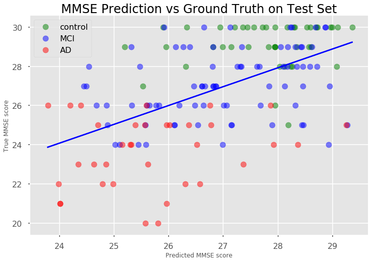
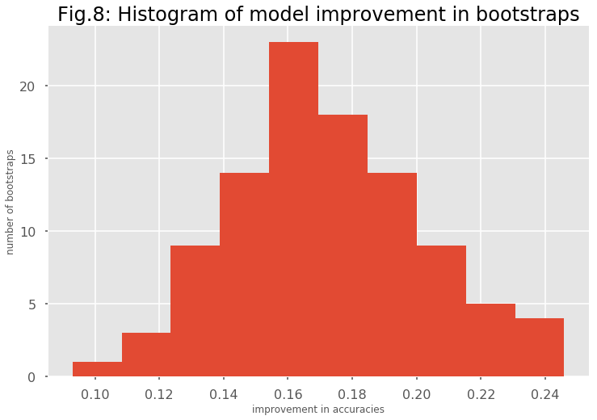

## Contents
{:.no_toc}
*  
{: toc}


## Model Performance Comparison
  
  
To evaluate our models, we used 3 different metrics: R2 score, Pearson's correlation coefficient (PCC) and Concordance correlation coefficient (CCC), all on the test set. The latter is the metric used in the AD DREAM challenge to score the leaderboard.


<div>
<style>
    .dataframe thead tr:only-child th {
        text-align: right;
    }

    .dataframe thead th {
        text-align: left;
    }

    .dataframe tbody tr th {
        vertical-align: top;
    }
</style>
<table border="1" class="dataframe">
  <thead>
    <tr style="text-align: right;">
      <th></th>
      <th>model name</th>
      <th>R2train</th>
      <th>R2test</th>
      <th>PCC</th>
      <th>CCC</th>
    </tr>
  </thead>
  <tbody>
    <tr>
      <th>0</th>
      <td>linear regression with all predictors</td>
      <td>1.000000</td>
      <td>-0.575704</td>
      <td>0.292637</td>
      <td>0.291248</td>
    </tr>
    <tr>
      <th>1</th>
      <td>linear regression on 197 PCs</td>
      <td>0.607145</td>
      <td>0.146130</td>
      <td>0.462699</td>
      <td>0.434770</td>
    </tr>
    <tr>
      <th>2</th>
      <td>ridge regression with 197 PCs</td>
      <td>0.471062</td>
      <td>0.265014</td>
      <td>0.518424</td>
      <td>0.419588</td>
    </tr>
    <tr>
      <th>3</th>
      <td>Elastic Net regression with 197 PCs</td>
      <td>0.430632</td>
      <td>0.267113</td>
      <td>0.520643</td>
      <td>0.415252</td>
    </tr>
    <tr>
      <th>4</th>
      <td>linear regression with 20 PCs</td>
      <td>0.321961</td>
      <td>0.226916</td>
      <td>0.486073</td>
      <td>0.415090</td>
    </tr>
    <tr>
      <th>5</th>
      <td>linear regression with 5 predictors</td>
      <td>0.347888</td>
      <td>0.263385</td>
      <td>0.522998</td>
      <td>0.457284</td>
    </tr>
    <tr>
      <th>6</th>
      <td>linear regression model with Ridge regularizat...</td>
      <td>0.346355</td>
      <td>0.267639</td>
      <td>0.522654</td>
      <td>0.441700</td>
    </tr>
    <tr>
      <th>7</th>
      <td>Random Forest Regressor with all predictors</td>
      <td>0.796740</td>
      <td>0.240607</td>
      <td>0.497886</td>
      <td>0.351548</td>
    </tr>
    <tr>
      <th>8</th>
      <td>gradient boosting regressor with all predictors</td>
      <td>0.996073</td>
      <td>0.289511</td>
      <td>0.538661</td>
      <td>0.458527</td>
    </tr>
  </tbody>
</table>
</div>


The best model in all 3 evaluation metrics (R2 score, Pearson's correlation coefficient, Concordance correlation coefficient, all on test set) is the gradient boosting regressor. Assuming our test set is representative of the test set used for the AD DREAM challenge, our Concordance correlation coefficient of 0.47 would place us on rank 8 of the [final leaderboard](https://www.synapse.org/#!Synapse:syn2290704/wiki/68513). The Pearson's correlation coefficient would place us even higher. We use our optimal model to visualize how our predicted MMSE scores compare to the true MMSE scores, both on the training set and test set. We also visualize the different diagnoses classes (CN = control, MCI = mild cognitive impairment and AD = Alzheimer's disease) in these diagrams.





Based on the distribution of different diagnosis classes in this graph, it should be possible to use the predicted MMSE in the prediction of diagnoses.

## Influence of estimated MMSE on diagnosis prediction
  
  
We are first comparing three simple logistic regression classifiers: One that uses only the demographic data for predicting diagnosis, one that uses the actual MMSE score and one that uses our predicted MMSE score. The first achieves only 46% accuracy on the test set, whereas the second achieves 69%. The model with our predicted MMSE score is halfway between these 2 extremes with 56% accuracy.


    model with demographic factors only:
    training accuracy:  0.511677282378
    test accuracy:  0.464968152866


    model with demographic factors + true MMSE score:
    training accuracy:  0.713375796178
    test accuracy:  0.694267515924


    model with demographic factors + our estimated MMSE score:
    training accuracy:  0.71974522293
    test accuracy:  0.56050955414


In order to getter a better estimate and a significance value for the improvement, we perform bootstrapping by resampling our training set with replacement, use the remaining observations as test set and determine the difference in test accuracies between the base model and our (putatively) improved model.





    mean improvement by inclusion of predicted MMSE score:  0.172099557385
    Null Hypothesis: Including predicted MMSE has no effect on accuracy of classifier
    p-value:  7.61810278112e-78


The improvement in test accuracies appears roughly normally distributed and has a mean of 17%. Based on a paired t-test, these effects are highly significant.

## Discussion
  
  
We have shown that our best models can compete with other submissions to the AD DREAM challenge and even outperform 2/3 of the submissions. We have also shown that the predicted MMSE scores from our best model are good enough to significantly improve Alzheimer's Disease/Dementia diagnosis. However, given more time, there might be ways to further improve our model: We currently use preprocessed geometrical data to approximate brain morphology as our predictors; the raw MRI data might contain information that is not captured by this data. Training a deep neural net on raw MRI images might improve our prediction.  
It is remarkable that a number of our models is performing relatively well. Combining these models by stacking might further improve our prediction.


```python

```

