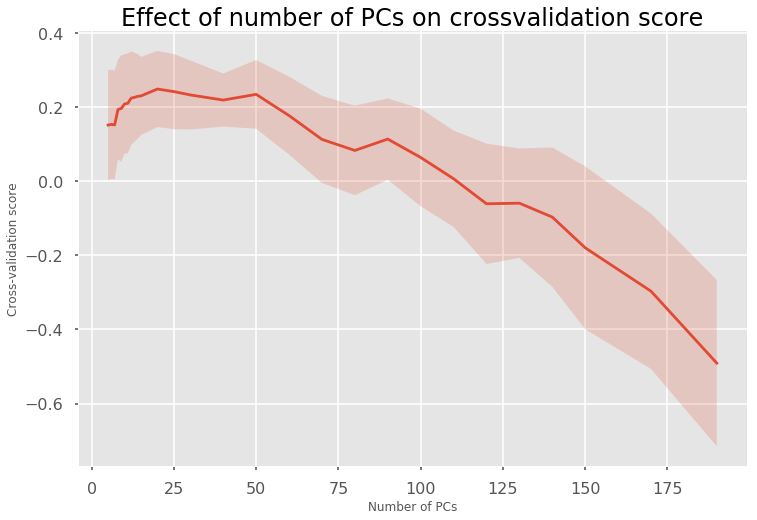
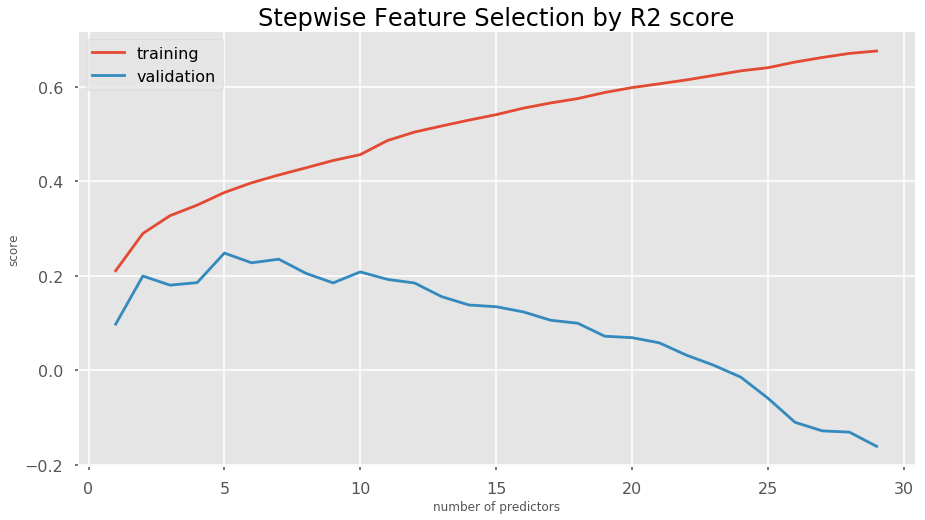

## Contents
{:.no_toc}
*  
{: toc}


## Baseline Model: Simple Linear Regression


Our first step is to clean up the demographic variables and split our data into training and test sets. We group all the predictors (demographic + MRI imaging) together and extract 2 outcome variables: 1.) the MMSE score which we want to predict, and 2.) the diagnosis which we will use to evaluate the usefulness of our MMSE prediction in the last part.  
We first try a simple linear regression model with all predictors and MMSE as the outcome.


    Linear regression with all predictors : 
    R2 score on training set:  1.0
    R2 score on validation set:  -0.575703582103
    Pearson's correlation coefficient between estimate and ground truth(test set) 0.292637073937
    Concordance correlation coefficient between estimate and ground truth(test set) 0.29124810158


Because of the large number of predictors and the multi-colinearity of the predictors, the model with all predictors suffers from high variance which is characterized by a large discrepancy between performances on the training and test sets. Overall, variance appears to be the biggest problem in predicting this dataset. We will use principal component analysis, stepwise feature selection and ensemble strategies to reduce the dimensionality and eliminate colinearity. In addition, we will try regularization to further reduce variance problems.

## Principal Component Analysis and Regularized Linear Regression
  
    
    
First, we reduce the dimensionality by principal component analysis and keep enough principal components that capture 90% of the variance in the data. 


    Number of PCs accounting for 90% of variance:  197


We still have 197 components/predictors left after principal component analysis. Let's try a simple linear regression model on these:


    Linear regression on 197 PCs : 
    R2 score on training set:  0.607144507434
    R2 score on validation set:  0.146129866785
    Pearson's correlation coefficient between estimate and ground truth(test set) 0.462698583976
    Concordance correlation coefficient between estimate and ground truth(test set) 0.434770218566


While our test set performance has improved, we still have a relatively high discrepancy between performance on the training and test set which is indicative of variance problems. Even though we have eliminated co-linearity between predictors through PCA, this does not mean that each of our predictors is correlated with our outcome variable MMSE. We will try different types of regularization to reduce variance and improve our bias/variance trade-off.  
We first try ridge regularization with cross-validation to identify the ideal regularization strength hyper-parameter, then train on the whole training set with the optimal parameter.


    Ridge regression with 197 PCs : 
    Regularization parameter:  5000
    R2 score on training set:  0.471061556011
    R2 score on validation set:  0.265014380849
    Pearson's correlation coefficient between estimate and ground truth(test set) 0.518424013095
    Concordance correlation coefficient between estimate and ground truth(test set) 0.419587774173


This has improved our R2 score on the test set quite dramatically. We try another type of regularization, Elastic Net regularization. This method combines L1 (Lasso) and L2 (Ridge) regularization. We cross-validate for regularization strength and the ratio between L1 and L2.


    Elastic Net regression with 197 PCs : 
    Regularization parameter:  10.0
    L1 ratio:  0.01
    R2 score on training set:  0.430632422622
    R2 score on validation set:  0.267113344982
    Pearson's correlation coefficient between estimate and ground truth(test set) 0.52064312814
    Concordance correlation coefficient between estimate and ground truth(test set) 0.41525211834


The Elastic Net regularization has not improved our model compared to ridge regularization. Moreover, the optimal ratio between L1 and L2 regularization  is very close to pure L2 regularization, further confirming ridge regularization as the optimal decision in this scenario.

As an alternative to regularization, we try to determine the optimal number of PCs to include in a simple linear regression model.


    
    Optimal number of principal components:  20
    linear regression with 20 PCs : 
    R2 score on training set:  0.321961145795
    R2 score on validation set:  0.226915996482
    Pearson's correlation coefficient between estimate and ground truth(test set) 0.486073194638
    Concordance correlation coefficient between estimate and ground truth(test set) 0.41508971522





Based on our cross-validation results, including the first 5 principal components yields the best test R2 score. This is also illustrated in the figure above. The test R2 score of this unregularized model with 20 PCs is comparable to the Ridge regression model on all 197 PCs. Further regularization does not improve this model (data not shown).

## Step-wise feature selection based on cross-validation score
  
    
In lieu of PCA, we also try dimensionality reduction by step-wise feature selection. We first split our training set into a smaller training set to stepwise select predictors and a validation set to select the number of predictors to keep. We use a simple linear regression model without regularization for this purpose.


    linear regression with 5 predictors : 
    optimal number of predictors:  5
    predictors:  ['FreeSurfer.thickness..mean.1009', 'FreeSurfer.thickness..mean.2006', 'mean.curvature..kurtosis.1007', 'geodesic.depth..SD.1011', 'PTEDUCAT']
    R2 score on training set:  0.347888052415
    R2 score on validation set:  0.263384791347
    Pearson's correlation coefficient between estimate and ground truth(test set) 0.522998265342
    Concordance correlation coefficient between estimate and ground truth(test set) 0.457283947517





The graph shows that the bias/variance trade-off is optimal for a model with 5 predictors where the R2 score on the validation set is highest. This simple linear regression model with only 5 predictors and no regularization achieves a similar performance as the PCA models. We next check if regularization (Ridge Regularization with Cross-validation) improves this model further.


    linear regression model with Ridge regularization on 197 PCA predictors : 
    Regularization parameter for Ridge regularization:  50
    R2 score on training set:  0.346354646594
    R2 score on validation set:  0.267638593243
    Pearson's correlation coefficient between estimate and ground truth(test set) 0.522653783263
    Concordance correlation coefficient between estimate and ground truth(test set) 0.441699871133


Regularization does not appear to improve the plain linear regression model further.

## Ensemble Methods
  
### Random Forest Regressor
  
   
Ensemble methods like Random Forest Regression or Gradient Boosting are another way to reduce the number of features being considered in the model. We first try Random Forest Regression and crossvalidate to optimize the maximum depth of the trees on a relatively small number of trees (64), we fix the number of features to the square root of all features (46). We then increase the number of trees to 512 to acchieve a slightly better model. Because of the long time it takes to compute these Random Forests we did not perform an exhaustive grid search of all hyper-parameters.


    RandomForestRegressor(bootstrap=True, criterion='mse', max_depth=6,
               max_features='sqrt', max_leaf_nodes=None,
               min_impurity_decrease=0.0, min_impurity_split=None,
               min_samples_leaf=1, min_samples_split=2,
               min_weight_fraction_leaf=0.0, n_estimators=64, n_jobs=1,
               oob_score=False, random_state=7, verbose=0, warm_start=False)
    optimal max_depth:  6


    Random Forest Regressor with all predictors : 
    R2 score on training set:  0.796739832447
    R2 score on validation set:  0.240607085902
    Pearson's correlation coefficient between estimate and ground truth(test set) 0.497885936163
    Concordance correlation coefficient between estimate and ground truth(test set) 0.351548345382


At least for the limited set of hyper-parameters we tested, the random forest model does not perform as well as our previous models.

### Gradient Boosting Regressor
  
We then tried a Gradient Boosting Regressor for our prediction using crossvalidation to determine the optimal depth of the individual estimators as well as the number of estimators. We then retrain on the complete training set and acchieve the best model performance so far:


    GradientBoostingRegressor(alpha=0.9, criterion='friedman_mse', init=None,
                 learning_rate=0.1, loss='ls', max_depth=4, max_features=None,
                 max_leaf_nodes=None, min_impurity_decrease=0.0,
                 min_impurity_split=None, min_samples_leaf=1,
                 min_samples_split=2, min_weight_fraction_leaf=0.0,
                 n_estimators=100, presort='auto', random_state=None,
                 subsample=1.0, verbose=0, warm_start=False)


    gradient boosting regressor with all predictors : 
    R2 score on training set:  0.996073175562
    R2 score on validation set:  0.289511344235
    Pearson's correlation coefficient between estimate and ground truth(test set) 0.538660917627
    Concordance correlation coefficient between estimate and ground truth(test set) 0.458527158448


```python

```

