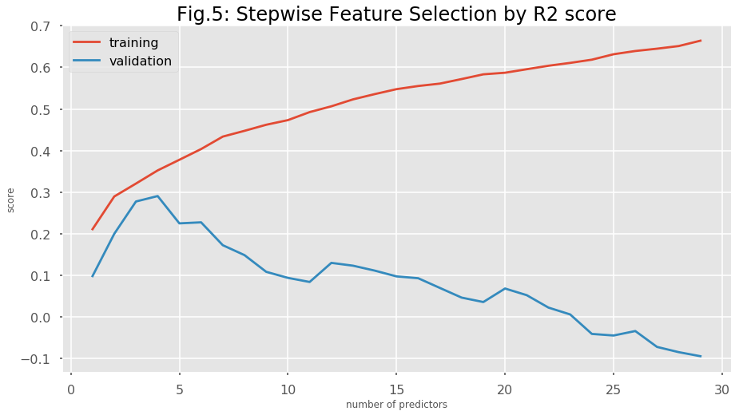
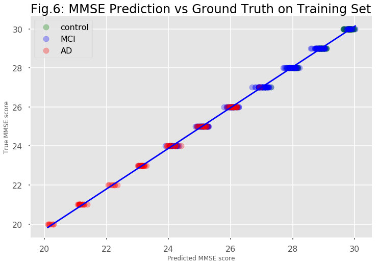
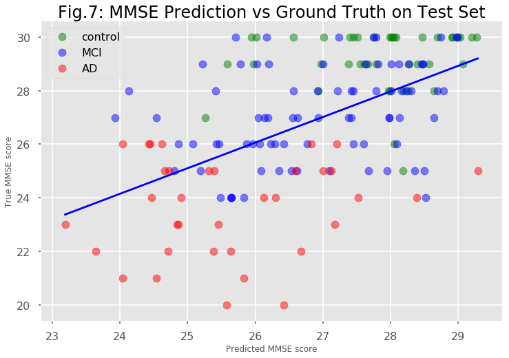
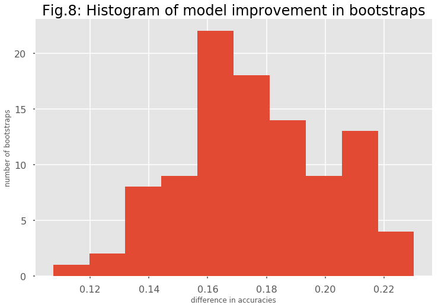

## Contents
{:.no_toc}
*  
{: toc}


  
   
    
Alzheimer's disease (AD) is characterized by 2 major diagnostic features: pathological changes in the brain namely beta-amyloid placques and deterioration of the mental state leading to cognitive impairment and ultimately dementia. Neither of these features is sufficient but both are necessary for a definitive AD diagnosis. While beta-amyloid placques are present very early during disease progression, cognitive impairment only manifests in the latest stages of the disease when a treatment is deemed impossible. In this project, we will focus on these 2 features separately and 1.) try to predict beta-amyloid placques from ???? and 2.) try to predict the mental state from brain imaging data. These 2 parts are inspired by subchallenges 2 and 3 of the ADNI Big Data DREAM Challenge.

### PART 1: Predicting beta-amyloid placques


### PART 2: Predicting mental state (MMSE) from brain imaging data (MRI)


In the second part of the project, we focus on the question if we can predict the mental state of a patient from brain imaging data. In the ADNI dataset, the mental state is represented by the Mini-Mental State Exam (MMSE) score which is the variable that we are trying to predict in this part of the project.
Since the psychological pathology develops relatively late in the disease progression, it would be advantageous to be able to predict the mental state from MRI brain imaging data which is routinely acquired in clinical settings (e.g. to exclude other types of dementia). In our analysis, we follow closely the the guidelines given in the AD Big Data Dream Challenge Subchallenge 3 (https://www.synapse.org/#!Synapse:syn2290704/wiki/64635).   
  
We downloaded the data for this challenge from https://ida.loni.usc.edu/pages/access/studyData.jsp?categoryId=43&subCategoryId=94 (password-protected login).

Initial Data Exploration:
The data in the baseline_data.csv file consists of 628 rows corresponding to unique observations of 628 patients. It contains 2150 measurements of brain geometry derived from 3D MRI images, e.g. area, thickness, curvature, etc. of different brain regions. It can be assumed that many of these variables are correlated with each other because of geometrical necessity.
The spreadsheeet also contains demographic data such as education, ethnicity, gender, race and age as well as some diagnostic data: MMSE score, Diagnosis, Apoe4 genotype. The Apoe4 allele is a polymorphism of the Apo E gene that is associated with AD susceptibility. In addition, there is an indicator variable for Apoe4 imputation.  
We cleaned up 


```python
import warnings
warnings.filterwarnings('ignore')

import numpy as np
import pandas as pd
import matplotlib
import matplotlib.pyplot as plt
import sklearn.metrics as metrics
from scipy import stats
from sklearn.model_selection import cross_val_score
from sklearn.model_selection import GridSearchCV
from sklearn.model_selection import train_test_split

import statsmodels.api as sm
from statsmodels.api import OLS

from sklearn.model_selection import KFold
from sklearn.decomposition import PCA
from sklearn.linear_model import LinearRegression
from sklearn.linear_model import Ridge
from sklearn.linear_model import RidgeCV
from sklearn.linear_model import ElasticNetCV
from sklearn.linear_model import ElasticNet
from sklearn.utils import resample
from sklearn.model_selection import cross_val_score
from sklearn.metrics import accuracy_score
from sklearn.metrics import r2_score
from sklearn.ensemble import GradientBoostingRegressor
from sklearn.ensemble import RandomForestRegressor

from scipy.stats import pearsonr
from scipy.stats import ttest_1samp
from sklearn.linear_model import LogisticRegression
from sklearn.linear_model import LogisticRegressionCV

import seaborn.apionly as sns
sns.set_context("poster")
from IPython.display import display
matplotlib.style.use('ggplot')
%matplotlib inline

```


```python
def ccc_function(y,y_hat):
    pcc, _ = pearsonr(y_hat,y)
    ccc = 2 * pcc * y.std() * y_hat.std()/(y.var() + y_hat.var() + (y.mean() - y_hat.mean())**2)
    return ccc
```


  
  
We load the data and have a look at the imaging part and the demographic part.


```python
#read data from file
data = pd.read_csv('baseline_data.csv')
print(data.shape)

print(len(data.RID.unique()))

#split data into image data and demographic data
image_data = data.iloc[:,:-13].copy()
demographic = data.iloc[:,-13:].copy()
mmse = data['MMSE']
dx = (data['DX.bl'] == 'LMCI') * 1. + (data['DX.bl'] == 'AD') * 2.

display(image_data.head())
display(demographic.head())
```


    (628, 2163)
    628


<div>
<style>
    .dataframe thead tr:only-child th {
        text-align: right;
    }

    .dataframe thead th {
        text-align: left;
    }

    .dataframe tbody tr th {
        vertical-align: top;
    }
</style>
<table border="1" class="dataframe">
  <thead>
    <tr style="text-align: right;">
      <th></th>
      <th>area.1002</th>
      <th>area.1003</th>
      <th>area.1005</th>
      <th>area.1006</th>
      <th>area.1007</th>
      <th>area.1008</th>
      <th>area.1009</th>
      <th>area.1011</th>
      <th>area.1012</th>
      <th>area.1013</th>
      <th>...</th>
      <th>Thickness..thickinthehead..2021</th>
      <th>Thickness..thickinthehead..2022</th>
      <th>Thickness..thickinthehead..2024</th>
      <th>Thickness..thickinthehead..2025</th>
      <th>Thickness..thickinthehead..2028</th>
      <th>Thickness..thickinthehead..2029</th>
      <th>Thickness..thickinthehead..2030</th>
      <th>Thickness..thickinthehead..2031</th>
      <th>Thickness..thickinthehead..2034</th>
      <th>Thickness..thickinthehead..2035</th>
    </tr>
  </thead>
  <tbody>
    <tr>
      <th>0</th>
      <td>612.577638</td>
      <td>2514.366512</td>
      <td>1652.050796</td>
      <td>731.718725</td>
      <td>3794.131041</td>
      <td>5012.960558</td>
      <td>4951.994756</td>
      <td>5666.361234</td>
      <td>2568.454160</td>
      <td>3147.024829</td>
      <td>...</td>
      <td>0.2927</td>
      <td>0.3276</td>
      <td>0.3645</td>
      <td>0.4358</td>
      <td>0.4446</td>
      <td>0.3887</td>
      <td>0.4558</td>
      <td>0.4107</td>
      <td>0.3230</td>
      <td>0.4806</td>
    </tr>
    <tr>
      <th>1</th>
      <td>735.292087</td>
      <td>2435.629408</td>
      <td>1947.966106</td>
      <td>721.230657</td>
      <td>4101.035394</td>
      <td>4469.814924</td>
      <td>4002.936490</td>
      <td>5427.875646</td>
      <td>2778.342103</td>
      <td>3907.628206</td>
      <td>...</td>
      <td>0.3240</td>
      <td>0.3247</td>
      <td>0.3886</td>
      <td>0.4416</td>
      <td>0.4823</td>
      <td>0.3790</td>
      <td>0.4650</td>
      <td>0.4499</td>
      <td>0.3923</td>
      <td>0.5315</td>
    </tr>
    <tr>
      <th>2</th>
      <td>1080.976588</td>
      <td>2190.801306</td>
      <td>1613.620315</td>
      <td>636.078912</td>
      <td>5146.969073</td>
      <td>6192.609394</td>
      <td>4640.889149</td>
      <td>6854.023127</td>
      <td>3282.902615</td>
      <td>3677.408865</td>
      <td>...</td>
      <td>0.2343</td>
      <td>0.2491</td>
      <td>0.2727</td>
      <td>0.3267</td>
      <td>0.3098</td>
      <td>0.3001</td>
      <td>0.3069</td>
      <td>0.3129</td>
      <td>0.2369</td>
      <td>0.3357</td>
    </tr>
    <tr>
      <th>3</th>
      <td>840.850798</td>
      <td>2293.601605</td>
      <td>1599.807666</td>
      <td>729.344575</td>
      <td>3351.924971</td>
      <td>4231.417941</td>
      <td>3991.795466</td>
      <td>5047.106646</td>
      <td>2599.222056</td>
      <td>3339.590461</td>
      <td>...</td>
      <td>0.2643</td>
      <td>0.2978</td>
      <td>0.3116</td>
      <td>0.3823</td>
      <td>0.3976</td>
      <td>0.3235</td>
      <td>0.3808</td>
      <td>0.3769</td>
      <td>0.2902</td>
      <td>0.4899</td>
    </tr>
    <tr>
      <th>4</th>
      <td>592.882184</td>
      <td>1827.195664</td>
      <td>1479.821407</td>
      <td>535.558408</td>
      <td>3459.934118</td>
      <td>5063.103074</td>
      <td>3583.954659</td>
      <td>4120.492969</td>
      <td>2462.352998</td>
      <td>2737.467877</td>
      <td>...</td>
      <td>0.2603</td>
      <td>0.3267</td>
      <td>0.3871</td>
      <td>0.4370</td>
      <td>0.4861</td>
      <td>0.3592</td>
      <td>0.4216</td>
      <td>0.4238</td>
      <td>0.3356</td>
      <td>0.4893</td>
    </tr>
  </tbody>
</table>
<p>5 rows × 2150 columns</p>
</div>


<div>
<style>
    .dataframe thead tr:only-child th {
        text-align: right;
    }

    .dataframe thead th {
        text-align: left;
    }

    .dataframe tbody tr th {
        vertical-align: top;
    }
</style>
<table border="1" class="dataframe">
  <thead>
    <tr style="text-align: right;">
      <th></th>
      <th>directory.id</th>
      <th>Subject</th>
      <th>RID</th>
      <th>Image.Data.ID</th>
      <th>DX.bl</th>
      <th>AGE</th>
      <th>PTGENDER</th>
      <th>PTEDUCAT</th>
      <th>PTETHCAT</th>
      <th>PTRACCAT</th>
      <th>APOE4</th>
      <th>MMSE</th>
      <th>imputed_genotype</th>
    </tr>
  </thead>
  <tbody>
    <tr>
      <th>0</th>
      <td>178eeac87ff2460568a8709ba32f9b1e</td>
      <td>002_S_0295</td>
      <td>295</td>
      <td>45108</td>
      <td>CN</td>
      <td>84.8</td>
      <td>Male</td>
      <td>18</td>
      <td>Not Hisp/Latino</td>
      <td>White</td>
      <td>1</td>
      <td>28</td>
      <td>True</td>
    </tr>
    <tr>
      <th>1</th>
      <td>4d953ce78fb484052e8b735e5493770a</td>
      <td>002_S_0413</td>
      <td>413</td>
      <td>45117</td>
      <td>CN</td>
      <td>76.3</td>
      <td>Female</td>
      <td>16</td>
      <td>Not Hisp/Latino</td>
      <td>White</td>
      <td>0</td>
      <td>29</td>
      <td>True</td>
    </tr>
    <tr>
      <th>2</th>
      <td>da022a5df80d136d3aa26bfa06702278</td>
      <td>002_S_0619</td>
      <td>619</td>
      <td>48617</td>
      <td>AD</td>
      <td>77.5</td>
      <td>Male</td>
      <td>12</td>
      <td>Not Hisp/Latino</td>
      <td>White</td>
      <td>2</td>
      <td>22</td>
      <td>False</td>
    </tr>
    <tr>
      <th>3</th>
      <td>7d700a43e372c9dfabd6c2dfdc0edcf8</td>
      <td>002_S_0685</td>
      <td>685</td>
      <td>40683</td>
      <td>CN</td>
      <td>89.6</td>
      <td>Female</td>
      <td>16</td>
      <td>Not Hisp/Latino</td>
      <td>White</td>
      <td>0</td>
      <td>30</td>
      <td>True</td>
    </tr>
    <tr>
      <th>4</th>
      <td>c033f6026da1179ab7b5f7e4f5559f59</td>
      <td>002_S_0729</td>
      <td>729</td>
      <td>40708</td>
      <td>LMCI</td>
      <td>65.1</td>
      <td>Female</td>
      <td>16</td>
      <td>Not Hisp/Latino</td>
      <td>White</td>
      <td>1</td>
      <td>27</td>
      <td>True</td>
    </tr>
  </tbody>
</table>
</div>


```python
fig1 = plt.figure(figsize = [15,15])


plt.subplot(2,2,1)
ax = plt.gca()
data.boxplot('MMSE',by = ['DX.bl'], ax = ax)
plt.title('Fig. 1a: MMSE by Diagnosis')
plt.xlabel('Diagnosis')
plt.ylabel('MMSE')

plt.subplot(2,2,2)
ax = plt.gca()
data.boxplot('MMSE',by = ['APOE4'], ax = ax)
plt.title('Fig. 1b: MMSE by Apoe4 allele number')
plt.xlabel('Apoe4 allele number')
plt.ylabel('MMSE')

plt.subplot(2,2,3)
ax = plt.gca()
data.boxplot('MMSE',by = ['PTGENDER'], ax = ax)
plt.title('Fig. 1c: MMSE by Gender')
plt.xlabel('Gender')
plt.ylabel('MMSE')

plt.subplot(2,2,4)
ax = plt.gca()
plt.scatter(data['AGE'],mmse,alpha=0.3)
plt.title('Fig. 1d: MMSE by Age')
plt.xlabel('Age')
plt.ylabel('MMSE');


fig1.suptitle('Fig. 1: EDA of MMSE Scores with Respect to Diagnosis and Demographic Factors',fontsize= 30);
```


There is a clear correlation of MMSE score with the diagnosis of the patient. Healthy control patients (CN) have an MMSE score near the maximum of 30, whereas patients with light cognitive impairment (LMCI) have a lower median MMSE and Alzheimer's disease patients (AD) have the lowest median MMSE score.  This indicates that MMSE can be used to predict Alzheimer's disease or dementia in general.  
The MMSE score is also strongly correlated with the Apoe4 genotype. In particular, individuals that are homozygous for the Apoe4 allele, i.e. they have 2 copies of it, display a lower MMSE score.  
On the other hand, other demographic predictors like gender or age do not appear to be strongly correlated with the MMSE score.  
  
   
We now try to find the features in the imaging data that are most correlated with the MMSE score:


```python

corr_coefs = []
pvals = []

for column in image_data.columns.values:
    coef,pval = pearsonr(image_data[column],mmse)
    corr_coefs.append(coef)
    pvals.append(pval)
    
print("image measurements most closely correlated with mmse score:")
best6 = image_data.columns.values[np.argsort(pvals)[:6]]
print(best6)

```


    image measurements most closely correlated with mmse score:
    ['FreeSurfer.thickness..mean.1006' 'FreeSurfer.thickness..mean.2006'
     'FreeSurfer.thickness..25..1006' 'FreeSurfer.thickness..median.1006'
     'FreeSurfer.thickness..75..1006' 'FreeSurfer.thickness..25..1009']


```python
fig2 = plt.figure(figsize= [15,15])

for i,feature in enumerate(best6):
    plt.subplot(3,2,i+1)
    plt.scatter(image_data[feature],mmse,alpha=0.3)
    plt.xlabel(feature)
    plt.ylabel('MMSE')
    beta1,beta0 = np.polyfit(image_data[feature],mmse,deg=1)
    f = lambda x: beta1 * x + beta0
    x = np.array([np.min(image_data[feature]), np.max(image_data[feature])])
    plt.plot(x,f(x),c='orange')
    sns.despine()
fig2.suptitle('Fig. 2: EDA of Image Features most closely correlated with MMSE score',fontsize= 30);  
```


Some of the features in the imaging data appear to be strongly correlated with the MMSE score which makes the analysis/prediction promising. 
We also notice that we now have 2159 predictors which is a lot more than the 628 observations we have in our complete dataset. This causes a big danger of overfitting any training data.  
We next clean up the demographic variables and split our data in training and test sets. Then we will check if we  have multi-colinearity in the imaging predictors.


```python

demographic['PTETHCAT'] = (demographic.PTETHCAT == 'Hisp/Latino') * 1.

demographic = pd.get_dummies(demographic,columns=['PTRACCAT','APOE4'],drop_first=True)

demographic['PTGENDER'] = (demographic.PTGENDER == 'Female') * 1.

demographic['imputed_genotype'] = (demographic.imputed_genotype == True)* 1.

y = mmse
y_dx = dx

image_columns = image_data.columns.values

demographic_columns = ['AGE','PTGENDER','PTEDUCAT','PTETHCAT','imputed_genotype','PTRACCAT_Black','PTRACCAT_White','APOE4_1','APOE4_2']


X = pd.concat([image_data,demographic[demographic_columns]],axis=1)
print(X.shape)

#check that there is no NaN's in the data
print(np.sum(np.sum(X.isnull())))

X_train, X_test, y_train, y_test, y_dx_train, y_dx_test = train_test_split(X,y,y_dx,train_size = 0.75,random_state=8)


mean = X_train.mean(axis=0)
std = X_train.std(axis=0)

X_train = (X_train - mean)/std
X_test = (X_test - mean)/std
```


    (628, 2159)
    0


```python

```


  
  
    
      
We calculate a correlation matrix and display it as a heatmap


```python
corr_mat = np.corrcoef(X_train.as_matrix().T)

fig3 = plt.figure(figsize = [15,15])
ax = plt.gca()
plt.set_cmap("bwr")
heatmap = plt.imshow(corr_mat)
plt.title('Fig. 3: Heatmap of Correlation Matrix of all Predictors',fontsize=24);
plt.colorbar(heatmap);
```


There is a lot of colinearity between the predictors in the imaging data. Colinear variables appear to be organized in ordered blocks. In order to get a working prediction model, we will have to reduce the dimensionality and co-linearity  first to reduce the danger of overfitting.


We first try a simple linear regression model with all features.


```python
summary = {'model name':[],'R2':[],"PCC":[],'CCC':[]}

simple_est = LinearRegression(fit_intercept = True)
simple_est.fit(X_train,y_train)
y_hat_train = simple_est.predict(X_train)
y_hat_test = simple_est.predict(X_test)

print('\nsimple linear regression model with all predictors: ')
print('R2 score on training set: ',r2_score(y_train,y_hat_train))
print('R2 score on test set: ',r2_score(y_test,y_hat_test))
pcc, _ = pearsonr(y_test,y_hat_test)
ccc = ccc_function(y_test,y_hat_test)
print("Pearson's correlation coefficient between estimate and ground truth(test set)", pcc)
print("Concordance correlation coefficient between estimate and ground truth(test set)", ccc)

summary['model name'].append('linear regression with all predictors')
summary['R2'].append(r2_score(y_test,y_hat_test))
summary['PCC'].append(pcc)
summary['CCC'].append(ccc)


```


    
    simple linear regression model with all predictors: 
    R2 score on training set:  1.0
    R2 score on test set:  -0.575703582103
    Pearson's correlation coefficient between estimate and ground truth(test set) 0.292637073937
    Concordance correlation coefficient between estimate and ground truth(test set) 0.29124810158


Because of the large number of predictors and the multi-colinearity of the predictors, the model with all predictors suffers from high variance. Overall, variance appears to be the biggest problem in predicting this dataset. We will use principal components analysis, stepwise feature selection and Random Forest Regression strategies to reduce the dimensionality and eliminate colinearity. In addition, we will use regularization to further reduce variance problems.

  
    
    
First, we reduce the dimensionality by principal component analysis and keep enough principal components that capture 90% of the variance in the data. 


```python
fullpca = PCA(n_components = 0.9,svd_solver = 'full')
X_train_pca = fullpca.fit_transform(X_train)
X_test_pca = fullpca.transform(X_test)
total_pcs = X_train_pca.shape[1]
print("Number of PCs accounting for 90% of variance: ", total_pcs)
```


    Number of PCs accounting for 90% of variance:  197


We still have 197 predictors left after principal component analysis. Let's try a simple linear regression model


```python
pca_lin_est = LinearRegression(fit_intercept = True)
pca_lin_est.fit(X_train_pca,y_train)
y_hat_train = pca_lin_est.predict(X_train_pca)
y_hat_test = pca_lin_est.predict(X_test_pca)
print('simple linear regression model on {} principal components: '.format(total_pcs))
print('R2 score on training set: ',r2_score(y_train,y_hat_train))
print('R2 score on test set: ',r2_score(y_test,y_hat_test))
pcc, _ = pearsonr(y_test,y_hat_test)
ccc = ccc_function(y_test,y_hat_test)
print("Pearson's correlation coefficient between estimate and ground truth(test set)", pcc)
print("Concordance correlation coefficient between estimate and ground truth(test set)", ccc)

summary['model name'].append('linear regression on {} PCs'.format(total_pcs))
summary['R2'].append(r2_score(y_test,y_hat_test))
summary['PCC'].append(pcc)
summary['CCC'].append(ccc)

```


    simple linear regression model on 197 principal components: 
    R2 score on training set:  0.607144507434
    R2 score on test set:  0.146129866785
    Pearson's correlation coefficient between estimate and ground truth(test set) 0.462698583976
    Concordance correlation coefficient between estimate and ground truth(test set) 0.434770218566


```python
alphas = [100000,50000,10000,5000,1000,500,100,50,10,5,1,0.5,0.1,0.05,0.01]

ridge_pca_est = RidgeCV(alphas=alphas,fit_intercept = True,cv=5)
ridge_pca_est.fit(X_train_pca,y_train)
best_alpha = ridge_pca_est.alpha_

ridge_pca_est = Ridge(alpha=best_alpha,fit_intercept = True)
ridge_pca_est.fit(X_train_pca,y_train)
y_hat_train = ridge_pca_est.predict(X_train_pca)
y_hat_test = ridge_pca_est.predict(X_test_pca)

print('linear regression model with Ridge regularization on {} PCA predictors: '.format(total_pcs))
print("Regularization parameter for Ridge regularization: ",best_alpha)
print('R2 score on training set: ',r2_score(y_train,y_hat_train))
print('R2 score on test set: ',r2_score(y_test,y_hat_test))
pcc, _ = pearsonr(y_test,y_hat_test)
ccc = ccc_function(y_test,y_hat_test)
print("Pearson's correlation coefficient between estimate and ground truth(test set)", pcc)
print("Concordance correlation coefficient between estimate and ground truth(test set)", ccc)

summary['model name'].append('ridge regression with {} PCs'.format(total_pcs))
summary['R2'].append(r2_score(y_test,y_hat_test))
summary['PCC'].append(pcc)
summary['CCC'].append(ccc)


```


    linear regression model with Ridge regularization on 197 PCA predictors: 
    Regularization parameter for Ridge regularization:  5000
    R2 score on training set:  0.471061556011
    R2 score on test set:  0.265014380849
    Pearson's correlation coefficient between estimate and ground truth(test set) 0.518424013095
    Concordance correlation coefficient between estimate and ground truth(test set) 0.419587774173


```python
ratios = [.001,.01,.1, .5, .7, .9, .95, .99, 1]
elnet_est = ElasticNetCV(l1_ratio = ratios, alphas=alphas,fit_intercept = True,cv=5)
elnet_est.fit(X_train_pca,y_train)
y_hat_train = elnet_est.predict(X_train_pca)
y_hat_test = elnet_est.predict(X_test_pca)

print('linear regression model with Elastic Net regularization on 198 PCA predictors: ')
print('Regularization parameter: ', elnet_est.alpha_)
print('L1 ratio: ', elnet_est.l1_ratio_)
print('R2 score on training set: ',r2_score(y_train,y_hat_train))
print('R2 score on test set: ',r2_score(y_test,y_hat_test))
pcc, _ = pearsonr(y_test,y_hat_test)
ccc = ccc_function(y_test,y_hat_test)
print("Pearson's correlation coefficient between estimate and ground truth(test set)", pcc)
print("Concordance correlation coefficient between estimate and ground truth(test set)", ccc)

summary['model name'].append('Elastic Net regression with {} PCs'.format(total_pcs))
summary['R2'].append(r2_score(y_test,y_hat_test))
summary['PCC'].append(pcc)
summary['CCC'].append(ccc)

```


    linear regression model with Elastic Net regularization on 198 PCA predictors: 
    Regularization parameter:  10.0
    L1 ratio:  0.01
    R2 score on training set:  0.430632422622
    R2 score on test set:  0.267113344982
    Pearson's correlation coefficient between estimate and ground truth(test set) 0.52064312814
    Concordance correlation coefficient between estimate and ground truth(test set) 0.41525211834


```python
scorelist = []

#pcs = range(1,total_pcs+1)
pcs = [5,6,7,8,9,10,11,12,13,14,15,20,25,30,40,50,60,70,80,90,100,110,120,130,140,150,170,190]
for use_pcs in pcs:
    scores = cross_val_score(pca_lin_est,X_train_pca[:,:use_pcs],y_train,cv=5)
    scorelist.append(scores)
```


```python
#plot crossvalidation score means and std as a function of number of PCs
score_array = np.vstack(scorelist)    
valid_means = score_array.mean(axis=1)
valid_stds = score_array.std(axis=1)

fig4 = plt.figure(figsize = [12,8])
plt.title('Fig.4: Effect of number of PCs', fontsize = 24)
ax = plt.gca()
plt.plot(pcs,valid_means)
ax.fill_between(pcs,valid_means+valid_stds,valid_means-valid_stds,alpha = 0.2)
ax.set_ylabel('Cross-validation score')
ax.set_xlabel('Number of PCs')
sns.despine()

optimal_pcs = pcs[np.argmax(valid_means)]
print("\nOptimal number of principal components: ",optimal_pcs)


pca_lin_est.fit(X_train_pca[:,:optimal_pcs],y_train)

y_hat_train = pca_lin_est.predict(X_train_pca[:,:optimal_pcs])
y_hat_test = pca_lin_est.predict(X_test_pca[:,:optimal_pcs])

print('linear regression model with on {} PCA predictors: '.format(optimal_pcs))
print('R2 score on training set: ',r2_score(y_train,y_hat_train))
print('R2 score on test set: ',r2_score(y_test,y_hat_test))
pcc, _ = pearsonr(y_test,y_hat_test)
ccc = ccc_function(y_test,y_hat_test)
print("Pearson's correlation coefficient between estimate and ground truth(test set)", pcc)
print("Concordance correlation coefficient between estimate and ground truth(test set)", ccc)

summary['model name'].append('linear regression with {} PCs'.format(optimal_pcs))
summary['R2'].append(r2_score(y_test,y_hat_test))
summary['PCC'].append(pcc)
summary['CCC'].append(ccc)


```


    
    Optimal number of principal components:  20
    linear regression model with on 20 PCA predictors: 
    R2 score on training set:  0.321961145795
    R2 score on test set:  0.226915996482
    Pearson's correlation coefficient between estimate and ground truth(test set) 0.486073194638
    Concordance correlation coefficient between estimate and ground truth(test set) 0.41508971522


```python

```


```python

X_train_sm, X_valid,y_train_sm,y_valid = train_test_split(X_train,y_train,test_size= 150,random_state = 7)

all_predictors = X_train.columns.values
predictors = []

max_predictors = 30 
for k in range(1, max_predictors):
    if k == 1:
        used_predictors = []
    else:
        used_predictors = predictors[-1]
    unused_predictors = list(set(all_predictors) - set(used_predictors))
    xvalscores = []
    
    # add each of the unused predictors one at a time and store the mean cross-validation score
    for predictor in unused_predictors:

        k_predictors = used_predictors + [predictor]
        X_train_k = X_train_sm[k_predictors]
        linreg_est = LinearRegression(fit_intercept = True)
        kf = KFold(n_splits=3,shuffle=True,random_state = 1)
        score = cross_val_score(linreg_est,X_train_k,y_train_sm,cv=kf).mean()
        xvalscores.append(score)
    
    # choose the predictor that gives the best cross-validation score and add it to the list of used predictors
    best_k = used_predictors + [unused_predictors[np.argmax(xvalscores)]]
    
    predictors.append(best_k)
    


```


```python
train_scores = []
valid_scores = []
for p in predictors:
    linreg_est.fit(X_train_sm[p],y_train_sm)
    y_hat_train_sm = linreg_est.predict(X_train_sm[p])
    y_hat_valid = linreg_est.predict(X_valid[p])
    
    train_scores.append(r2_score(y_train_sm,y_hat_train_sm))
    valid_scores.append(r2_score(y_valid,y_hat_valid))

fig5 = plt.figure(figsize= [15,8])
plt.plot(range(1, max_predictors),train_scores)
plt.plot(range(1, max_predictors),valid_scores)
plt.title('Fig.5: Stepwise Feature Selection by R2 score',fontsize=24)
plt.xlabel('number of predictors')
plt.ylabel('score')
plt.legend(['training','validation'])

best_predictors = predictors[np.argmax(valid_scores)]


X_train_feat = X_train[best_predictors]
X_test_feat = X_test[best_predictors]

linreg_est = LinearRegression()
linreg_est.fit(X_train_feat,y_train)
y_hat_train = linreg_est.predict(X_train_feat)
y_hat_test = linreg_est.predict(X_test_feat)

print('optimal number of predictors: ',len(best_predictors))
print('predictors: ',best_predictors)
print('')
print('R2 score on training set: ',r2_score(y_train,y_hat_train))
print('R2 score on test set: ',r2_score(y_test,y_hat_test))
pcc, _ = pearsonr(y_test,y_hat_test)
ccc = ccc_function(y_test,y_hat_test)
print("Pearson's correlation coefficient between estimate and ground truth(test set)", pcc)
print("Concordance correlation coefficient between estimate and ground truth(test set)", ccc)

summary['model name'].append('linear regression with {} predictors'.format(len(best_predictors)))
summary['R2'].append(r2_score(y_test,y_hat_test))
summary['PCC'].append(pcc)
summary['CCC'].append(ccc)


```


    optimal number of predictors:  4
    predictors:  ['FreeSurfer.thickness..mean.1009', 'FreeSurfer.thickness..mean.2006', 'PTEDUCAT', 'APOE4_2']
    
    R2 score on training set:  0.340694228667
    R2 score on test set:  0.265400326902
    Pearson's correlation coefficient between estimate and ground truth(test set) 0.52477095932
    Concordance correlation coefficient between estimate and ground truth(test set) 0.456452790059





```python
#rf = RandomForestRegressor(n_estimators = 64,max_features = 'sqrt',random_state=7)
rf = RandomForestRegressor(n_estimators = 64,max_features = 'sqrt',random_state=7)

parameters = {'max_depth':[i for i in range(3,15)]}
gs_rf = GridSearchCV(rf,parameters)
gs_rf.fit(X_train,y_train)
print(gs_rf.best_estimator_)
print(gs_rf.best_estimator_.max_depth)
```


    RandomForestRegressor(bootstrap=True, criterion='mse', max_depth=6,
               max_features='sqrt', max_leaf_nodes=None,
               min_impurity_decrease=0.0, min_impurity_split=None,
               min_samples_leaf=1, min_samples_split=2,
               min_weight_fraction_leaf=0.0, n_estimators=64, n_jobs=1,
               oob_score=False, random_state=7, verbose=0, warm_start=False)
    6


```python
rf_est = RandomForestRegressor(n_estimators = 1024,max_features = 'sqrt',max_depth = 7)
rf_est.fit(X_train,y_train)
y_hat_train = rf_est.predict(X_train)
y_hat_test = rf_est.predict(X_test)

print('Random Forest Regressor:')
print('R2 score on training set: ',r2_score(y_train,y_hat_train))
print('R2 score on test set: ',r2_score(y_test,y_hat_test))
pcc, _ = pearsonr(y_test,y_hat_test)
ccc = ccc_function(y_test,y_hat_test)
print("Pearson's correlation coefficient between estimate and ground truth(test set)", pcc)
print("Concordance correlation coefficient between estimate and ground truth(test set)", ccc)

summary['model name'].append('random forest regressor on all predictors')
summary['R2'].append(r2_score(y_test,y_hat_test))
summary['PCC'].append(pcc)
summary['CCC'].append(ccc)
```


    Random Forest Regressor:
    R2 score on training set:  0.795842018684
    R2 score on test set:  0.244450523159
    Pearson's correlation coefficient between estimate and ground truth(test set) 0.502965146513
    Concordance correlation coefficient between estimate and ground truth(test set) 0.353924239695


```python

```


```python

gbr = GradientBoostingRegressor()
parameters = {'max_depth':[i for i in range(1,5)],'n_estimators':[i*50 for i in range(1,4)]}
gs_gbr = GridSearchCV(gbr,parameters)
gs_gbr.fit(X_train,y_train)
print(gs_gbr.best_estimator_)

y_hat_train = gs_gbr.predict(X_train)
y_hat_test = gs_gbr.predict(X_test)

print('gradient boosting model on all predictors: ')
print('R2 score on training set: ',r2_score(y_train,y_hat_train))
print('R2 score on validation set: ',r2_score(y_test,y_hat_test))
pcc, _ = pearsonr(y_test,y_hat_test)
ccc = ccc_function(y_test,y_hat_test)
print("Pearson's correlation coefficient between estimate and ground truth(test set)", pcc)
print("Concordance correlation coefficient between estimate and ground truth(test set)", ccc)


```


    GradientBoostingRegressor(alpha=0.9, criterion='friedman_mse', init=None,
                 learning_rate=0.1, loss='ls', max_depth=3, max_features=None,
                 max_leaf_nodes=None, min_impurity_decrease=0.0,
                 min_impurity_split=None, min_samples_leaf=1,
                 min_samples_split=2, min_weight_fraction_leaf=0.0,
                 n_estimators=150, presort='auto', random_state=None,
                 subsample=1.0, verbose=0, warm_start=False)
    gradient boosting model on all predictors: 
    R2 score on training set:  0.989326079632
    R2 score on validation set:  0.282850364224
    Pearson's correlation coefficient between estimate and ground truth(test set) 0.534296525013
    Concordance correlation coefficient between estimate and ground truth(test set) 0.464175875957


```python
gbr_est = GradientBoostingRegressor(max_depth=4,n_estimators=100)
gbr_est.fit(X_train,y_train)

y_hat_train = gbr_est.predict(X_train)
y_hat_test = gbr_est.predict(X_test)

print('gradient boosting model on all predictors: ')
print('R2 score on training set: ',r2_score(y_train,y_hat_train))
print('R2 score on validation set: ',r2_score(y_test,y_hat_test))
pcc, _ = pearsonr(y_test,y_hat_test)
ccc = ccc_function(y_test,y_hat_test)
print("Pearson's correlation coefficient between estimate and ground truth(test set)", pcc)
print("Concordance correlation coefficient between estimate and ground truth(test set)", ccc)


summary['model name'].append('gradient boosting regressor with all predictors')
summary['R2'].append(r2_score(y_test,y_hat_test))
summary['PCC'].append(pcc)
summary['CCC'].append(ccc)
```


    gradient boosting model on all predictors: 
    R2 score on training set:  0.996273889194
    R2 score on validation set:  0.291945179015
    Pearson's correlation coefficient between estimate and ground truth(test set) 0.540980698324
    Concordance correlation coefficient between estimate and ground truth(test set) 0.463308675969


```python
display(pd.DataFrame(summary)[['model name','R2','PCC','CCC']])
```


<div>
<style>
    .dataframe thead tr:only-child th {
        text-align: right;
    }

    .dataframe thead th {
        text-align: left;
    }

    .dataframe tbody tr th {
        vertical-align: top;
    }
</style>
<table border="1" class="dataframe">
  <thead>
    <tr style="text-align: right;">
      <th></th>
      <th>model name</th>
      <th>R2</th>
      <th>PCC</th>
      <th>CCC</th>
    </tr>
  </thead>
  <tbody>
    <tr>
      <th>0</th>
      <td>linear regression with all predictors</td>
      <td>-0.575704</td>
      <td>0.292637</td>
      <td>0.291248</td>
    </tr>
    <tr>
      <th>1</th>
      <td>linear regression on 197 PCs</td>
      <td>0.146130</td>
      <td>0.462699</td>
      <td>0.434770</td>
    </tr>
    <tr>
      <th>2</th>
      <td>ridge regression with 197 PCs</td>
      <td>0.265014</td>
      <td>0.518424</td>
      <td>0.419588</td>
    </tr>
    <tr>
      <th>3</th>
      <td>Elastic Net regression with 197 PCs</td>
      <td>0.267113</td>
      <td>0.520643</td>
      <td>0.415252</td>
    </tr>
    <tr>
      <th>4</th>
      <td>linear regression with 20 PCs</td>
      <td>0.226916</td>
      <td>0.486073</td>
      <td>0.415090</td>
    </tr>
    <tr>
      <th>5</th>
      <td>linear regression with 4 predictors</td>
      <td>0.265400</td>
      <td>0.524771</td>
      <td>0.456453</td>
    </tr>
    <tr>
      <th>6</th>
      <td>random forest regressor on all predictors</td>
      <td>0.244451</td>
      <td>0.502965</td>
      <td>0.353924</td>
    </tr>
    <tr>
      <th>7</th>
      <td>gradient boosting regressor with all predictors</td>
      <td>0.291945</td>
      <td>0.540981</td>
      <td>0.463309</td>
    </tr>
  </tbody>
</table>
</div>


The best model in all 3 evaluation metrics (R2 score, Pearson's correlation coefficient, Concordance correlation coefficient) is the gradient boosting regressor. Assuming our test set is representative of the test set used for the AD DREAM challenge, our Concordance correlation coefficient of 0.47 would place us on rank 8 of the final leaderboard (https://www.synapse.org/#!Synapse:syn2290704/wiki/68513). The Pearson's correlation coefficient would place us even higher.


```python

y_hat_train = gbr_est.predict(X_train)
y_hat_test = gbr_est.predict(X_test)

idx1 = y_dx_train == 0
idx2 = y_dx_train == 1
idx3 = y_dx_train == 2

fig6 = plt.figure(figsize = [12,8])
plt.scatter(y_hat_train[idx1],y_train[idx1],alpha=0.3,c='green')
plt.scatter(y_hat_train[idx2],y_train[idx2],alpha=0.3,c='blue')
plt.scatter(y_hat_train[idx3],y_train[idx3],alpha=0.3,c='red')

plt.xlabel('Predicted MMSE score')
plt.ylabel('True MMSE score')
plt.legend(['control','MCI','AD'])

beta1,beta0 = np.polyfit(y_hat_train,y_train,deg=1)
f = lambda x: beta1 * x + beta0
x = np.array([np.min(y_hat_train), np.max(y_hat_train)])
plt.plot(x,f(x),c='blue')

plt.title('Fig.6: MMSE Prediction vs Ground Truth on Training Set',fontsize=24)
sns.despine()

idx1 = y_dx_test == 0
idx2 = y_dx_test == 1
idx3 = y_dx_test == 2

fig7 = plt.figure(figsize = [12,8])
plt.scatter(y_hat_test[idx1],y_test[idx1],alpha=0.5,c='green')
plt.scatter(y_hat_test[idx2],y_test[idx2],alpha=0.5,c='blue')
plt.scatter(y_hat_test[idx3],y_test[idx3],alpha=0.5,c='red')

plt.xlabel('Predicted MMSE score')
plt.ylabel('True MMSE score')
plt.legend(['control','MCI','AD'])
plt.title('Fig.7: MMSE Prediction vs Ground Truth on Test Set',fontsize=24)

#plot regression line
beta1,beta0 = np.polyfit(y_hat_test,y_test,deg=1)
f = lambda x: beta1 * x + beta0
x = np.array([np.min(y_hat_test), np.max(y_hat_test)])
plt.plot(x,f(x),c='blue')

sns.despine()
```








```python
X_est_train = X_train[demographic_columns].copy()
X_est_test = X_test[demographic_columns].copy()

Cs = [100000,50000,10000,5000,1000,500,100,50,10,5,1,0.5,0.1,0.05,0.01,0.005,0.001,0.0005,0.0001,0.00005,0.00001]
logreg_clf = LogisticRegressionCV(Cs=Cs)
logreg_clf.fit(X_est_train,y_dx_train)
y_hatdx_train = logreg_clf.predict(X_est_train)
y_hatdx_test = logreg_clf.predict(X_est_test)

train_acc = np.sum(y_hatdx_train == y_dx_train)/len(y_dx_train)
test_acc = np.sum(y_hatdx_test == y_dx_test)/len(y_dx_test)

print('model with demographic factors only:')
print('training accuracy: ',train_acc)
print('test accuracy: ', test_acc)
```


    model with demographic factors only:
    training accuracy:  0.511677282378
    test accuracy:  0.464968152866


```python
X_est_train['MMSE'] = y_train
X_est_test['MMSE'] = y_test

Cs = [100000,50000,10000,5000,1000,500,100,50,10,5,1,0.5,0.1,0.05,0.01,0.005,0.001,0.0005,0.0001,0.00005,0.00001]
logreg_clf = LogisticRegressionCV(Cs=Cs)
logreg_clf.fit(X_est_train,y_dx_train)
y_hatdx_train = logreg_clf.predict(X_est_train)
y_hatdx_test = logreg_clf.predict(X_est_test)

train_acc = np.sum(y_hatdx_train == y_dx_train)/len(y_dx_train)
test_acc = np.sum(y_hatdx_test == y_dx_test)/len(y_dx_test)

print('model with demographic factors + true MMSE score:')
print('training accuracy: ',train_acc)
print('test accuracy: ', test_acc)
```


    model with demographic factors + true MMSE score:
    training accuracy:  0.713375796178
    test accuracy:  0.694267515924


```python
X_est_train['MMSE'] = y_hat_train
X_est_test['MMSE'] = y_hat_test

Cs = [100000,50000,10000,5000,1000,500,100,50,10,5,1,0.5,0.1,0.05,0.01,0.005,0.001,0.0005,0.0001,0.00005,0.00001]
logreg_clf = LogisticRegressionCV(Cs=Cs)
logreg_clf.fit(X_est_train,y_dx_train)
print(logreg_clf.C_)
y_hatdx_train = logreg_clf.predict(X_est_train)
y_hatdx_test = logreg_clf.predict(X_est_test)

train_acc = np.sum(y_hatdx_train == y_dx_train)/len(y_dx_train)
test_acc = np.sum(y_hatdx_test == y_dx_test)/len(y_dx_test)

print('model with demographic factors + our estimated MMSE score:')
print('training accuracy: ',train_acc)
print('test accuracy: ', test_acc)
```


    [ 0.05  5.    0.01]
    model with demographic factors + our estimated MMSE score:
    training accuracy:  0.72186836518
    test accuracy:  0.56050955414


```python
num_iterations = 100
train_size = X_est_train.shape[0]
data = pd.concat([pd.concat([X_est_train,X_est_test]),pd.concat([y_dx_train,y_dx_test])],axis=1).values

test_acc_diffs = []

for i in range(num_iterations):
    # prepare train and test sets
    train = resample(data, n_samples=train_size)
    test = np.array([x for x in data if x.tolist() not in train.tolist()])
    X_train_bs = train[:,:-1]
    y_train_bs = train[:,-1]
    X_test_bs = test[:,:-1]
    y_test_bs = test[:,-1]
    
    # fit base model without mmse
    logreg_clf = LogisticRegressionCV(Cs=Cs)
    logreg_clf.fit(X_train_bs[:,:-1],y_train_bs)
    y_hat_base = logreg_clf.predict(X_test_bs[:,:-1])
    acc_base = np.sum(y_hat_base == y_test_bs)/len(y_test_bs)
    
    # fit mmse model 
    logreg_clf.fit(X_train_bs,y_train_bs)
    y_hat_mmse = logreg_clf.predict(X_test_bs)
    acc_mmse = np.sum(y_hat_mmse == y_test_bs)/len(y_test_bs)
    
    test_acc_diffs.append(acc_mmse - acc_base)

fig8 = plt.figure(figsize = [12,8])
plt.hist(test_acc_diffs)
plt.xlabel('difference in accuracies')
plt.ylabel('number of bootstraps')
plt.title('Fig.8: Histogram of model improvement in bootstraps',fontsize=24);
```





```python
_,pval = ttest_1samp(test_acc_diffs,popmean=0)
print('Null Hypothesis: Including predicted MMSE has no effect on accuracy of classifier')
print('p-value: ', pval)
```


    Null Hypothesis: Including predicted MMSE has no effect on accuracy of classifier
    p-value:  2.5083523657e-80


```python

```

